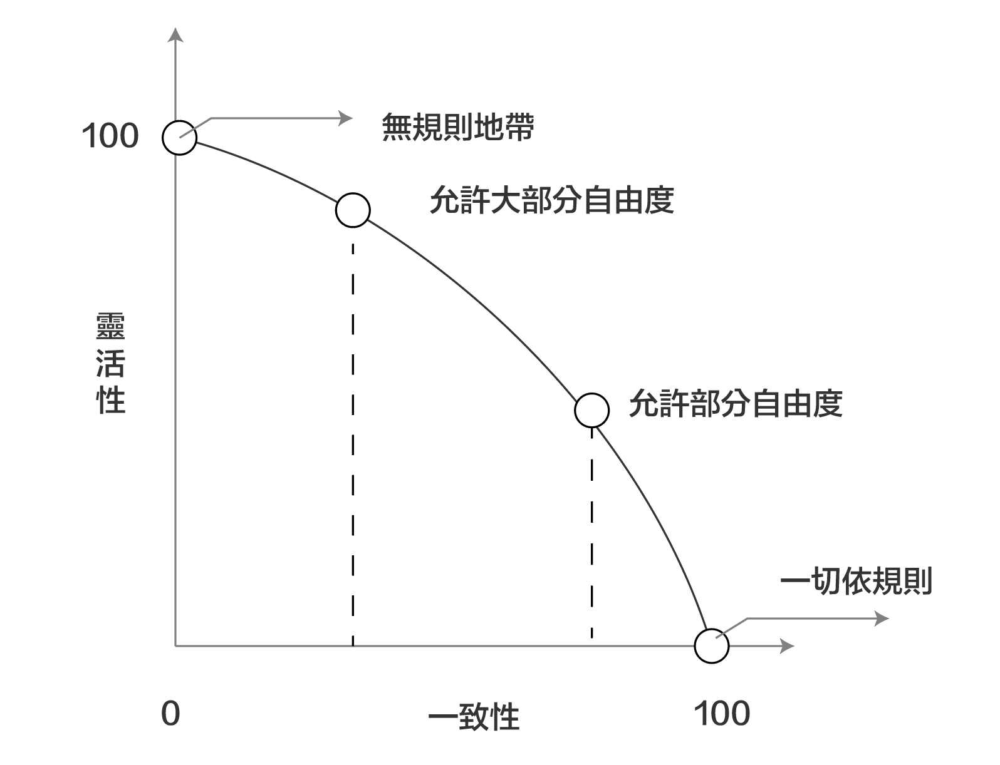
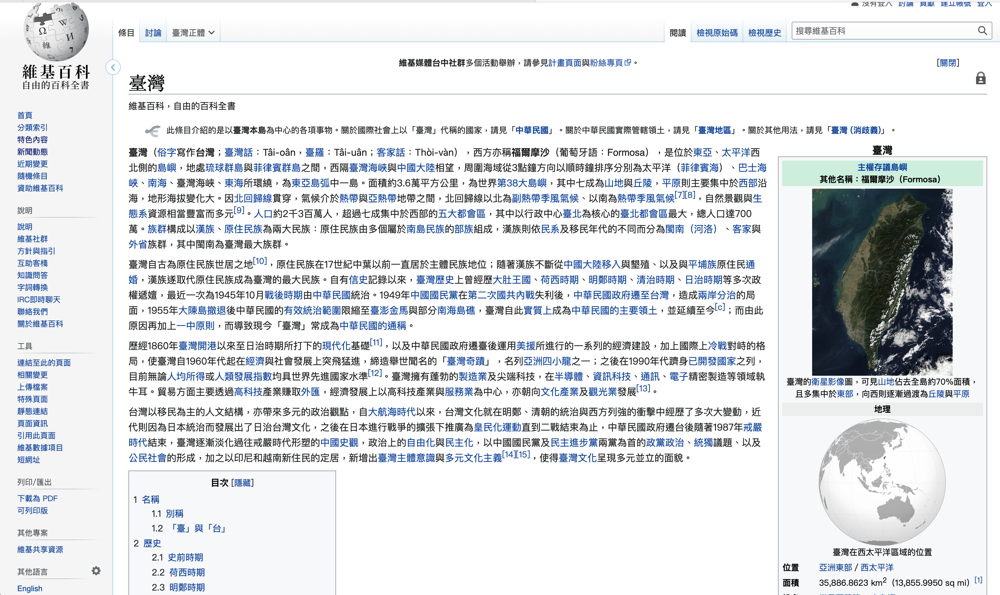

## 一致性

## 1. 一致性與靈活性

### 規則性與自由度

一致性與靈活性之間存在著互斥的關係，一方變強，另一方就被迫變弱。所謂的「一致性」可以當成規則性理解，靈活性則與自由度擁有相同的語意。

在設計上擁有 100%一致性的網站或應用程式都常存在著許多規則，例如元素與元件都是固定的，而新的元素無法在網站的構造以及元素裡佔有一席之地，相對的，這種設計有助於嚴格控管網站或應用程式，例如：Wikipedia 就是類似的範例。

而擁有 100% 靈活性的網站可被比喻成「無規則地帶」，除了能隨意地決定網站的構造，也能在頁面裡顯示任何元素，沒有規則的同時意謂著擁有最高的自由度，但是也
意謂著頁面之間沒有任何的整合性。草創時期的網站就是類似的範例。

---

> 靈活度高的apple網站

---

如今，大多數的網站或應用程式都介於兩者之間，也就是同時擁有一定程度的一致性與靈
活性，只要不追求 100% 的一致性，就能擁抱更多的靈活性。而犧牲某種程度的靈活性，就能得到多一點的一致性（例如能讓 LOGO、頁尾、頁首的設計變得一致），讓網站擁有更高的整合性，而原本各自獨立的頁面也能互相組成一個完整的網站。

> 一致性高的網站

---

要追求多高的一致性與靈活性，當然是設計網站時的重點之一，也只有在找出網站與應用
程式的功能與意義之後才能決定方向。可能的話，建議大家在網站設計初期就先決定兩者之間的比例。越是重要的規則得越先建立，因為建立規則之後再進行設計，會比從雜亂無章的設計找出規則還要容易許多。

在建立一致性的規則時，應該將重點放在建立不容易衍生例外的規則上，而不是放在建立
一個不容許任何例外發生的規則上，所以應該讓網站的外觀擁有能承受突發狀況的整合性，不過有些時候會被迫跳脫規則或是必須跳脫規則才能提升整體效果。如果進行製作不符一致性規則的設計，也應該止於枝微末節的部分，儘可能不要動到一定得符合一致性規則的區塊。總之要注意的是，要能不產生違和感地維持網站設計的一致性，藉此提升網站的效果、意義與實用性。

## 2. 一致性的效果

### 昜懂性與實用性

要想讓使用者覺得是相同的網站或應用程式，就必須讓操作方式或設計擁有一致性，例
如：以相同的規則設計頁首、頁尾、顏色、按鈕、圖示等視覺元素以及導覽列的操作方式。

擁有一致性的介面將能兼顧介面的易懂性與實用性。如果要舉例的話，大部分的使用者都覺得ios (iPhone）的智慧型手機應用程式比Android 的智慧型手機應用程式容易操作，其原因可能是因為整個系統的操作方式較簡單，或是視覺設計的元素較統一的關係，但是另項重要的原因應該是有沒有獨立的「回上頁」按鈕這一點，因為獨立的「回上一頁」按鈕的設計可連帶地為頁面創造一致性。

iPhone 不管是在硬體還是 OS，都沒有提供「回上一頁」按鈕，所以必須由應用程式提供「回上一頁」的功能，使得大部分的應用程式都需要這項功能，所以通常會在頁首標題的左側配置一個「上一頁頁面標籤」的按鈕。

另一方面，Android 智慧型手機的「回上一頁」按鈕是由硬體或 OS 提供，所以不需要像10S一樣在畫面裡配置「回上一頁」按鈕的功能，也不一定非得將按鈕配置在頁首裡。

不過 iOS的「回上一頁」按鈕雖然會佔據頁首的空間，但也能明確地標示出 「目前所在位置」或「上一頁頁面標籤」的內容，而且大部分的頁面都需要「回上一頁」按鈕，所以就結果來看，配置「回上一頁」按鈕反而讓所有的頁面都能顯示目前所在位置與上一頁頁面標籤，也等於賦子所有的頁面一致性，而這樣的一致性也讓 i0S 的操作變得更簡單好用。

反觀 Android 的設計就比較不受拘束，所以能否設計出擁有一致性的介面，端看開發人員與設計師的功力，而功力的高低也決定了應用程式的自由度以及操作上的實用性了。

## 3.「迷路」的原因何在

### 2大要因

#### - 不知身在何處
#### - 不知如何操作

在網站或應用程式裡「迷路」到底是什麼狀態呢？會在網站與應用程式裡「迷路」的理由
應該可歸結出兩大要因，一者是「不知身在何處」，一者是「不知道該如何操作」，又或者同時具備這兩種要因。更正確來說，應該就是「無法掌握該頁面與整體網站之間的相對位置」以及「不了解操作的規則性與一致性」。

例如要駕車前往某個目的地，不知道該將車子往哪個方向開就是「不知道身在何處」的意
思，而不知道車子該怎麼開，則是「不了解操作方法」的意思。如果能夠了解上述兩者，就能順理成章地到達目的地了

### 相對位置與一致性的呈現

為了讓使用者了解目前身在何處，就必須提醒使用者目前的位置與整體之間的相對位置，
因此開發人員可在全域導覽列、區域導覽列、麵包屑導覽這些導覽列標記目前所在位置，或是利用畫面元素的變化量以及頁面切換的互動性等前後關係的表現，以各種介面、設計效果來提醒使用者。

為了讓使用者了解操作方法，則必須設計出擁有規則性與一致性的操作方式，例如版型、頁面元素與元件都應該擁有一致的使用方法與效果，而這種具有一致性的設計可讓使用者預測接下來的操作將會產生什麼結果。

由此可知，相對位置的標示與操作方法的一致性都是讓網站或應用程式變得「簡單易懂」的重要因素。

