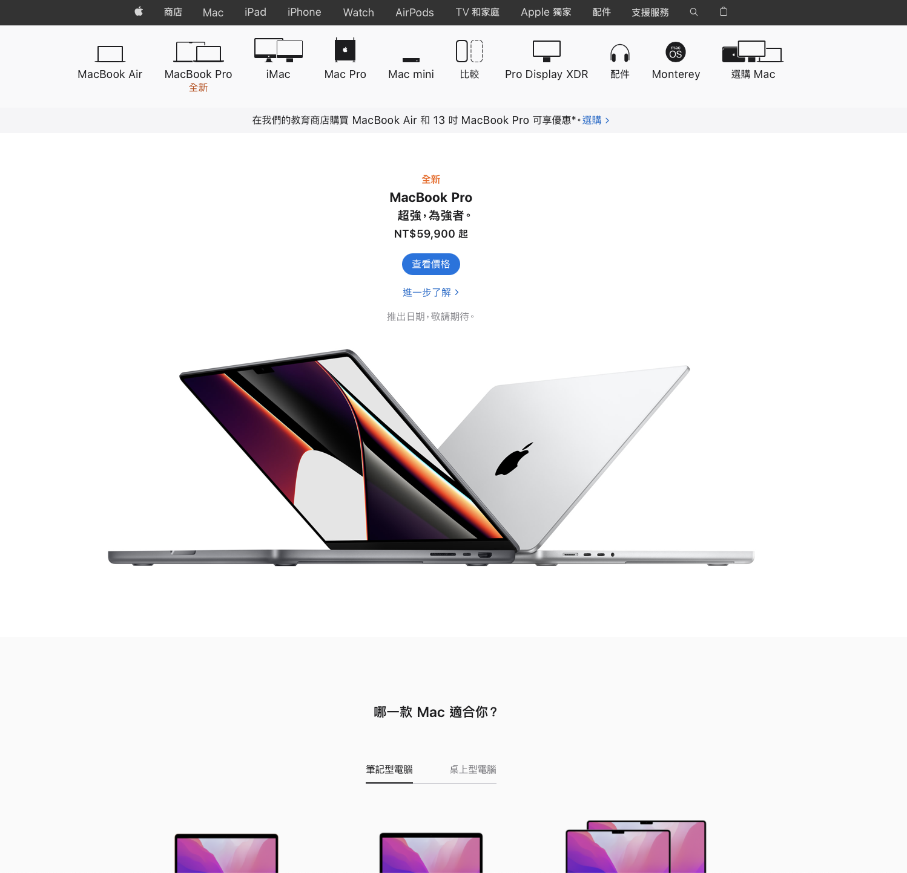

# Chapter1 網站架構(websize architecture)
## 佈局模式
 1. ### 何謂版型? 
#### 編排策略
版型的種類非常多，即便終端裝置再怎麽多元，使用的版型還是有共通之處，每一位使用
者對這個結論應該都能感同身受吧。而且網站的內容越是龐雜，就越有可能採用相同的版
型。對設計師而言，採用相同的版型也有助於提高版面設計的效率，因為設計師不再需要重頭
設計新的版面，只需要從現有版型設計之中選擇能解決當下需求的版型，然後再稍徽改造該
版型符合實需求即可。

重要的版面元素包含「頁首」、「全域導覽列」、「麵包屑導覽」、「區域導覽列」、「主要內容」「關聯性導覽列」與「頁尾」，而區域導覽列、主要內容與關聯性導覽列又被統稱為「內容區塊」。

基本版面可依照內容區塊的設計分成三種

-「單欄式」(1column）

-「雙欄式」（2 colum)

-「三欄式」 （3 column）

---

 

---

---

2. ### 單欄式版型  

#### 常見且高自由度的版型

單欄式版型的版面沒有進行任何分割，主要內容可佔據整個畫面的寬度，因此版面的設計
不受任何限制，任何終端裝置都可瀏覽這種版面，尤其智慧型手機或平板電腦（垂直畫面的情況）等寬度較窄的裝置，更是適合使用這類版型。

如果想要預留PC螢幕裡的寬度或是需要明快且大膽地提出網站的訴求時，此屬於非常適用的版型。這種版型雖然沒有分割出欄位，但版面的編排可絕不單純。例如 Apple 的網站幾乎都是單欄式的版型，卻能豐富且具魅力地呈現各類資訊。單欄式版型可充分測試的設計師功力，也是最適合表現視覺效果與創意的版型。

---

---

3. ### 單欄式版型的各種變化

#### 依照各種裝置特性的特殊編排

依據不同的裝置與網路服務的特性或是輸入方式，設計師設計編排出獨特的使用者介面。
而使用者介面越是獨特，就越容易選用單欄式版型。當然，除了單欄式版型，雙欄式或三欄式版型一樣能滿足設計上的需求。但是欄位越多，版面可能變得越是複雜，也就越難突顯使用者介面的獨特性與優勢。

---

---

4. ### 雙欄式版型  

#### 擁有輔助區塊的便利版型

雙欄式版型是在主要內容區塊的旁邊新增一處輔助區塊的版型，而輔助區塊可隨著網站或
應用程式的功能改變應用的方式與位置，所以能提升版面設計的靈活性。

配置在輔助區塊之內的元素包含「區域導覽列」、「關聯性導覽列」這類的導覽列，也可能包含廣告、橫幅 (banner)這類提供相關資訊、購買資訊與我的最愛的功能，總之是五花八門，尤其在輔助區塊裡配置導覽列的時侯還能加強網站的實用性，大幅提升點閱率與回頭率。
姑且不論功能面的優劣，如果是不需要佔據整個畫面寬度的版面，有時也會選擇雙欄式版
型來安排版面的空間。

如果是以平板電腦為瀏覽裝置的版面設計，可在垂直畫面裡使用單機式版型，轉成水平畫面時改用雙欄式版型。如此的巧思除了可顧及網站的實用性，就連版面的設計也將變得非常整齊而美麗。

-----

---

5. ### 三欄式版型

#### 便利性最高的版型

三欄式版型除了主要內容區塊之外，還有兩個輔助區塊，屬於便利性最高也最普遍的版
型。尤其是傳統的 PC 網站更是最常使用這種版型。這種版型通常會在左側區塊配置導覽列，然後在右側區塊配置非導覽列的資訊。在以記事為主體的部落格網站裡，有時會將主要內容區塊置於左側，然後將兩個輔助的區塊全部配置在右側。

這種版型的瓶頸在於需要足夠的畫面寬度，而就實際狀況來看，智慧型手機與適合垂直捲
動瀏覽的平板電腦不太適合瀏覽這種版面，換句話說，如果不是利用 PC 或橫向捲動的平板電腦瀏覽的話，是不太適合使用這種版面的。

但是，如果不受上述瀏覽環境的限制，就能像PC版的 Facebook一樣自由地在版面裡設置廣告區塊或是參考線。

---

---

 6. ### 雙欄式版型與三欄式版型的變化 

#### 跨晝面實現雙欄式與三欄式的設計

智慧型手機或平板電腦這類畫面尺寸受限的裝置可使用按鈕或是滑動畫面來跨畫面實現雙欄式或三欄式的版型。

雖然使用者必須多點一次按鈕或是滑動畫面，但是這種設計比隨時將資訊呈現在畫面裡的雙欄式或三欄式版型還要方便。這種設計可在需要資訊的時候立刻顯示資訊，又可以讓資訊暫時隱藏起來。但是，就程式開發的角度來看，這種設計手法比起應用在網站，更適合應用於應用程式，而且這種設計手法的最大效果就是能為智慧型手機或平板電腦此類畫面尺寸受限的裝置節省不少畫面空間。

智慧型手機的網站通常會將主要的導質列設置在頁首或是頁尾，不過若導覽列的項目數量
過多，就不大適合將導覽列配置在這兩處，此時只要將選單設計成滑動畫面，再將主要導
列的項目配置在選單裡，就能提供同等程度的便利性了

---

---

 7. 格狀設計

> 08 回應式網頁設計  

