## 垂直、水平、前後的立體構造
 1. ## 連結帶來的影響  

>  資訊的相關性

網站與應用程式。儘管在「要表現某些事物」這點是一樣的，但是從書籍與海報在本質上的差異來看，透過「連結」可讓不同的元素彼此串聯，並往返於各元素之間。不管是PC、智慧型手機、平板電腦，網站或應用程式該從何處來，又該往何處去，都有因「連結」而產生的資訊相關性。因此，關於網站或應用程式的設計，其設計的關鍵在於「如何讓每個元素彼此串聯」這點。

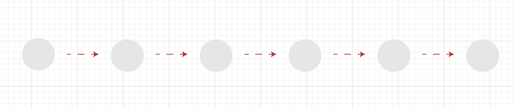

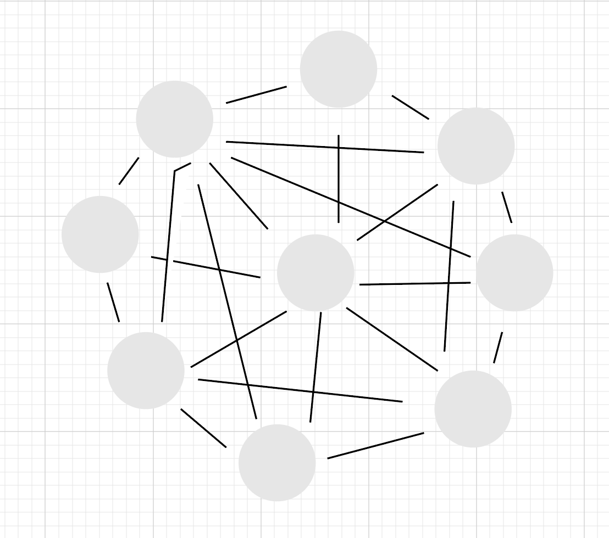

> 難用與難懂

難用與難懂的解決方式就是建立一套操作方式

 2. ## 掌握身在何處的四個元素  

#### 方便使用者移動的4個方法:
1. 現在位於哪一個頁面
2. 這個頁面的內容為何
3. 從哪裏來到這個頁面
4. 接下來可以前往那一個頁面

當使用者了解這四點之後，就能流暢地在各個頁面之間移動。即使有些許不了解，也無大
礙，但上述四點全部不了解的話，就無法移動了。因為要在頁面之間移動，必須先了解頁面
的前後關係，也必須了解現在的頁面與整體網站之間的相對位置

####  4個方法的表現方式

1. 現在位於哪一個頁面
	- 標題和導覽列可以說明

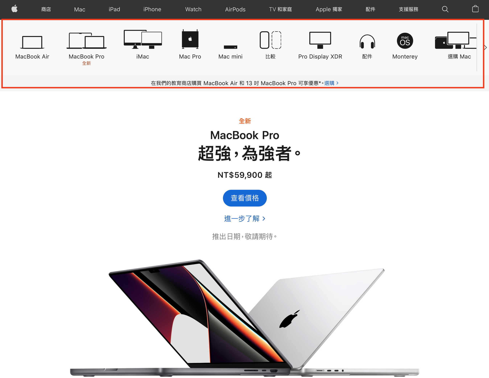
---

2. 這個頁面的內容為何
	- 標題和內容

---

3. 從哪裏來到這個頁面
	- 利用瀏灠器的上一頁
	- 利用互動性
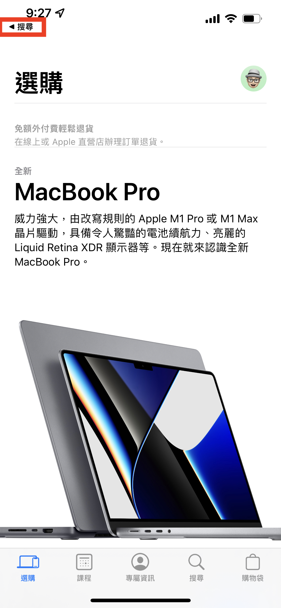
---

4. 接下來可以前往那一個頁面
	- 導覽列和按鈕
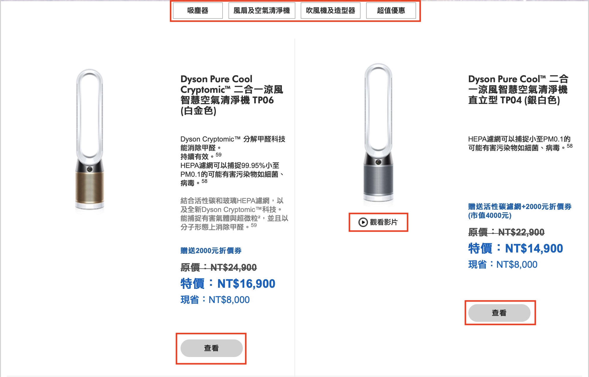
---
	
 
 4. ## 讓頁面的前後關系視覺化 

#### 以視覺的方式了解頁面的前後關係

要說明「從哪裡來到這個頁面」的方法之一就是在視覺呈現上下工夫最直接的方法就是直接顯示「從哪裡來到這個頁面」的訊息。例如i0S 的智慧型手機與平板電腦的應用程式為子讓使用者可以回到上個頁面，在頁首的左側設置了「從哪裡來到這個頁面」的按鈕。

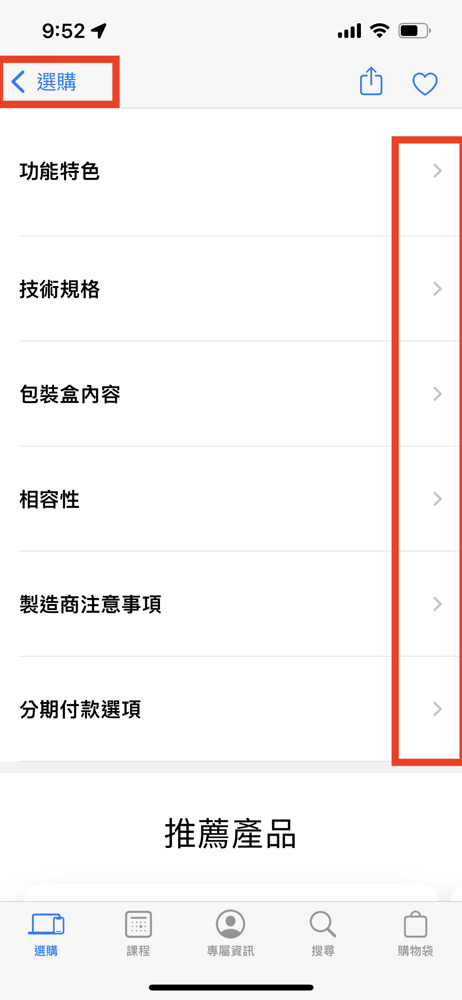
---

網站則是會在網頁外側設置「回上一頁，按鈕，所以就不需要設計類似 i0S 的功能了

---

#### 利用網頁變化量表現前後關係

更間接的表現方式就是頁面移動之後，網頁產生的「變化量」。往下一個頁面移動時，可
以將下一個頁面的視覺元素全部換掉，也可以只換掉局部的元素。如果要說哪一種是往較遠
的頁面移動的話，那絕對是全部換掉的前者。當頁面的構造與功能大幅改變時，頁面的編排
也會變得不同，頁面的變化量當然也就變大，相對的，如果下一個頁面的功能不變或是只有
一些相似的地方改變，頁面的變化量當然就比較小。

「掌控頁面的變化量」是一種讓使用者能憑著感覺了解頁面前後關係的設計，當變化量越
大，使用者就覺得移動到越遠的頁面，反之變量越小，使用者就覺得只移動到附近的頁面，因此只要根據前後頁面的變化量就能掌握頁面的距離，也能了解頁面所扮演的角色或功
能有什麼差異了。

##### 變化量小的網頁
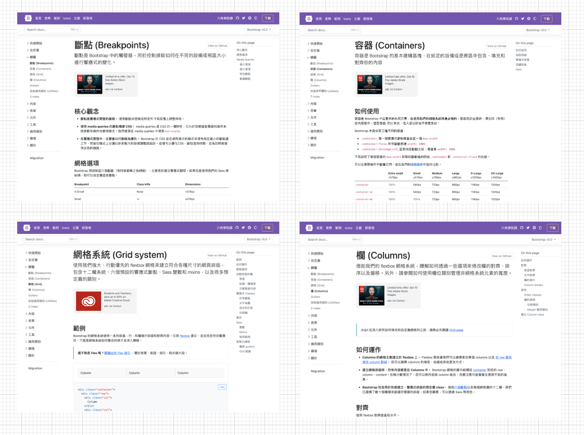

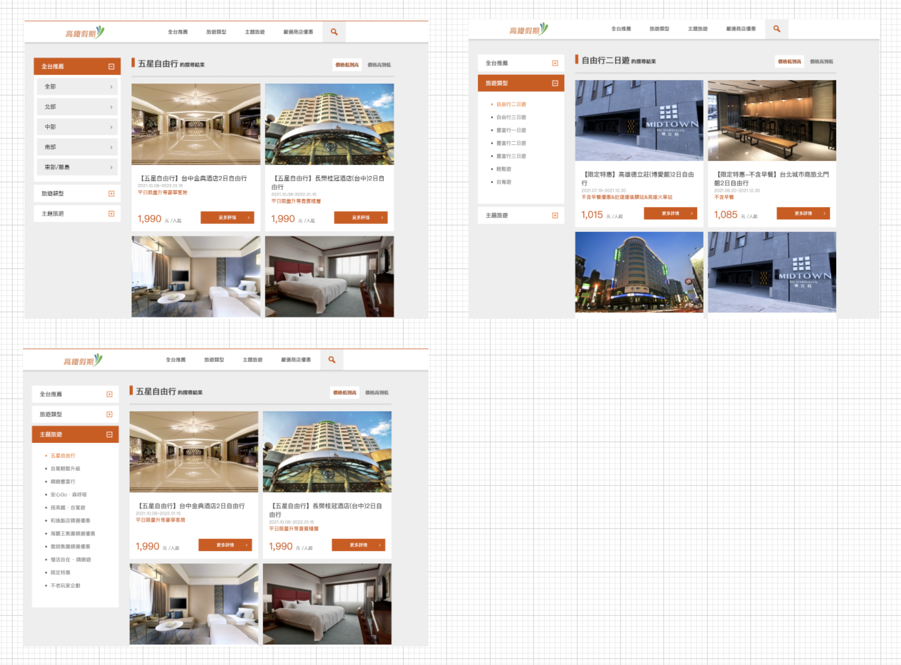

 
 5. ## 利用互動性表現頁面的前後關係 

直覺地了解前後關係互動性 (interaction）的設計也能讓使用者明
白「從哪裡來到這個頁面，的路徑。所謂的互動性，即對於使用者的操作有所反應的意思，而在頁面的設計裡，在移動至另一張頁面時，利用簡單易懂的效果或動畫即可讓使用者了解移動的路徑。

具體來說，大家可參考下列 iOS15的設定畫面。ioS7 會在換頁時套用縮放的動畫或是設計出上下階層的感覺（其他還有很多不同的呈現方式）•之所以要在智慧型手機的設定畫面或是應用程式裡，花這麽多心思將上下階層關係設計成具有互動性的樣式，是為了讓使用者了解移動的方向以及目前頁面內容的相關性

網站與應用程式的不同之處在於每一個網址都是個別的頁面，所以移動至任何頁面，網頁
都會重新載人（重新顯示），也因此比較不容易套用互動性的設計。不過智慧型手機或平板電腦的應用程式卻很適合利用互動性的效果來表現「切換頁面的路徑」

 
 6. ## 讓使用者透過視覺設計判斷目前所在位置  
#### 「光看」就知道的差異

目前所在位置、所處的分類以及正在瀏覽的位置可利用一眼就能看懂的「視覺差異設計」
讓使用者了解，如此一來，使用者就能直覺地掌握目前所在位置，以及自己身處的大範圍。

這樣的設計除了能讓使用者明白「身在何處」也能讓使用者更明白接下來能「往哪個頁」
移動。

視覺差異設計大致可分成下列四種：

- 粗體字:將文字設定為粗體
- 文字的顏色:替文字設定顏色
- 背景色:在背景鋪上色塊
- 符號:加註符號

實際使用時會同時搭配這幾種設計，讓視覺上的差異變得更加明顯，例如「文字搭配背景色」或是「粗體字搭配符號」使用，都能突顯所謂的差異性。

不過，差異性的種類有限，組合方式也有限，所以如何巧妙地組合這些視覺差異設計是頁面設計的關錐，而這些視覺差異設計的使用方式或組合方式也將大幅左右網站的便利性。

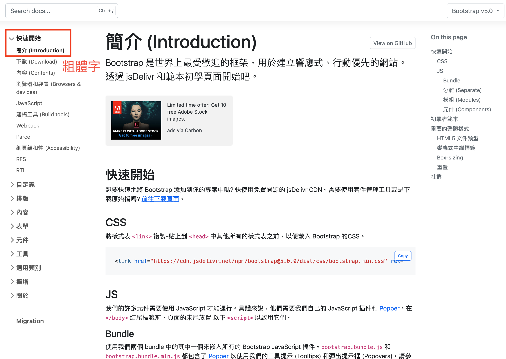

---

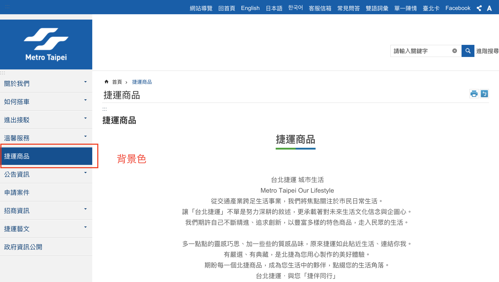

---

 
 7. ## 階層的廣度、深度和標籤
#### 要又深又窄還是又淺又廣
階層的「深度」與「廣度」之間在在著反比的關係。要將相同的資訊量塞進同一個網站時，如果將網站的階層設計得「很深」，階層的廣度就會變得很「狹窄」，反之，如果將階層設計得「很淺」，廣度就會變得「寬廣」。

雖然情況不盡相同，不過「又窄又深」的階層會比「又廣叉淺，的階層來得方便使用。理
由之一在於上下移動階層比在同一階層裡綜覽資料來得省力。不過更具影響力的部分在於各階層的標籤是否簡單昜懂

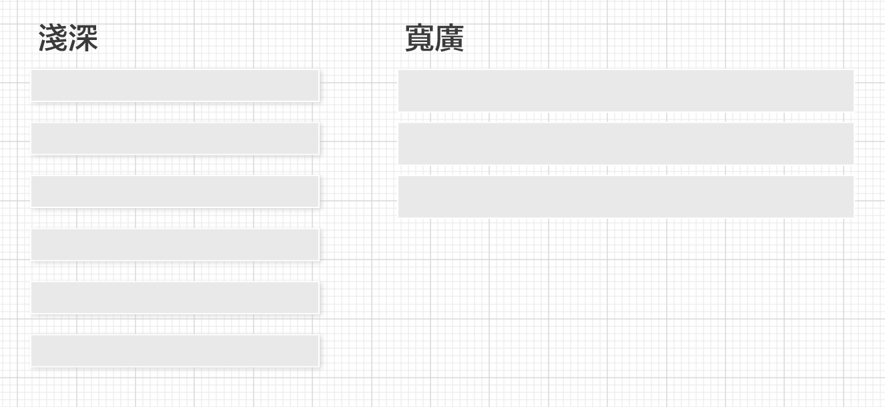

#### 標籤具有排他性
所謂「標籤」(label)，就是各項目的標題。為了不讓使用者迷路，必須讓每倜標籤擁有獨立的意義，也就是要讓每個標籤具有排他性。

在階層又窄又深的情況下，就需要更多能包含各項目與概念的標籤。為了能列舉各種抽象
的概念或是元素，就可能會使用「&」與黑點，或斜線「/」排列多個用語。反過來說當階層又淺又廣，標籤的意義通常變得更具體或是更具排他性。

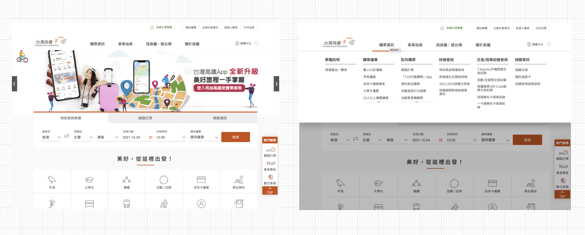

#### 三者為排擠關係

可是當階層又淺又廣，會變得難以掌握了解訊全貌。據說人類一次只能了解某件事物的
『7個」資訊，因此階層的廣度最好介於「5~8個」資訊，或許才算是方便好用的設計。

總結來說，階層的「深度」、「廣度」與「標籤」之間存在著互相排擠的關係。網站與應用程式的設計則需依照用途取得「深度」、「廣度」與「標籤」這三者的平衡。

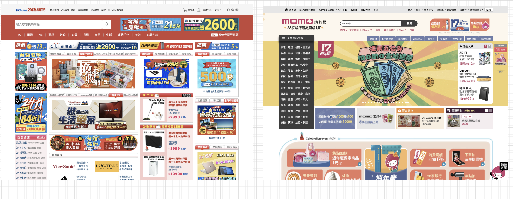

