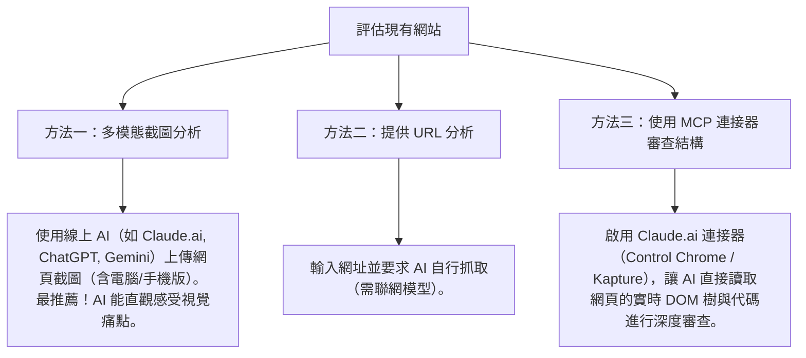

# 💡 AI 評估技巧與工具說明

[⬅️ 返回網站評估主頁](./README.md) ｜ [➡️ 前往下一章：UI/UX 評估提示詞](./02_UIUX評估提示詞.md)

---

## 🛠️ 評估網站的三大 AI 技巧

要讓 AI 給出精準的 UI/UX 評估，應根據您所擁有的資訊，選擇合適的提供方式：

> [!TIP]
> **💡 教學指引：如何向學生解釋「方法二（提供 URL 分析）」與「方法三（程式碼結構）」的差別？**
> 
> 雖然方法二與方法三都屬於「非視覺（不看圖）」的評估，但兩者的**評估視角與目的**截然不同：
> * **方法二（提供 URL 分析）——「黑箱測試 / 讀者視角」**
>   * **操作**：給 AI 網址或複製貼上網頁的「所有文字內容」。
>   * **評估重點**：看**內容文案與邏輯**。例如：產品說明夠不夠白話？網站導覽文字會不會讓人困惑？資訊階層的字彙是否符合一般人直覺？
>   * **比喻**：就像讀者在看一本書的**「內容與目錄」**，檢查文章寫得好不好懂、章節順序合不合邏輯。
> 
> * **方法三（使用 MCP 連接器）——「白箱測試 / 工程師視角」**
>   * **操作**：在 Claude.ai 網頁版啟用連接器（如 Control Chrome 或 Kapture Browser Automation），讓 AI 直接連線至你的瀏覽器分頁。
>   * **評估重點**：看**底層骨架與技術規範**。AI 能自動取得實時 DOM 樹、CSS 樣式與代碼結構，檢查如替代文字 alt 是否遺漏、標題層級是否正確、CSS 佈局是否有跑版風險，或是 JS 驗證邏輯是否安全。
>   * **比喻**：就像黑手打開汽車的**「引擎蓋」**，檢查裡面的線路接得對不對、零件安不安全。

---

### 💡 Q&A 進階探討：只給網址，AI 能切換到「工程師視角」嗎？DevTools MCP 如何顛覆這個限制？

#### Q1. 如果我只提供「網址 (URL)」，AI 網頁版有辦法用工程師視角評估嗎？
**答案是：效果非常有限，甚至經常會失敗。**
* **動態渲染與反爬蟲限制**：一般的聯網 AI 抓取器（Crawler）通常只能抓取網頁的「靜態 HTML」或「純文字」。對於現代使用 React/Vue 等框架動態渲染的單頁應用（SPA），或是設有 Cloudflare 等防爬蟲機制的網頁，外部 AI 無法抓到真實渲染後的 DOM 結構與 CSS。
* **登入牆限制**：如果需要評估的頁面需要登入（例如選課系統、後台管理），外部 AI 抓取器無法越過安全驗證進入。
因此，在一般網頁版 AI 中，**複製貼上程式碼（方法三）**依然是讓 AI 進行深度代碼審查最可靠的手法。

#### Q2. 我們可以利用 AI 配合「DevTools MCP」來解決這個痛點嗎？
**答案是：完全可以！這正是現代 AI 協作（AI Agent）最強大的「超級工程師視角」。**
如果你使用支援 **Chrome DevTools MCP (Model Context Protocol)** 的 AI 系統（例如 IDE 中的 AI 助手或自主 Agent），AI 不再只是被動地讀取網址，而是能直接**接管與操控你本地的 Chrome 瀏覽器**：
* **解析動態 DOM 與 CSS**：AI 能命令瀏覽器載入網址，完整執行 JavaScript 後，直接從瀏覽器內部讀取渲染完成的 DOM 樹與實時 CSS 樣式。
* **讀取 Console 與 Network 資訊**：AI 可以主動檢查 Console 面板中是否有錯誤日誌，或監控 Network 面板，看哪一個 API 請求載入太慢或有傳輸資安漏洞。
* **無障礙 (A11y) 與效能自動稽核**：AI 能自動在瀏覽器中運行 **Lighthouse**，直接讀取無障礙樹 (Accessibility Tree)，精確診斷對比度不足或標籤不正確的問題，並直接給予修復建議。

#### Q3. 如果我是使用 `claude.ai` 網頁版，不用下載 Claude Desktop 也能控制瀏覽器嗎？
**答案是：可以！Claude.ai 網頁版目前已支援「Connectors (連接器)」功能，能直接在網頁版中連線並操控你的 Chrome 瀏覽器：**

1. **開啟連接器目錄**：登入並開啟 `claude.ai` 網頁版，在對話框中開啟 **「Directory (工具與連接器目錄)」**。
2. **搜尋 Chrome 連接器**：選擇左側的 **Connectors**，並在上方搜尋框中輸入 `chrom`。
3. **新增連接器**（這兩個工具皆能讓 Claude 讀取網頁的實時 DOM 樹與代碼結構）：
   * 找到 **Control Chrome**（功能為：*Control Google Chrome browser tabs, windows, and navigation*，能取得頁面 HTML 與元素，並執行點擊、滾動等操作），點擊右側的 **`+`** 按鈕進行安裝。
   * 或者也可以選擇 **Kapture Browser Automation**（功能為：*透過 Chrome DevTools 協定控制瀏覽器*，特別適合需要進行深度 DOM 節點、主控台 Console 日誌與網絡請求分析的進階審查）。
4. **授權連結**：根據網頁提示，完成本地瀏覽器的連結授權。
5. **開始發問**：啟用後，你可以直接在對話框中命令網頁版 Claude，例如：「*請幫我開啟高鐵網站並評估其 UI/UX。*」
* **優點**：完全免安裝 Node.js、免寫任何 JSON 設定檔，非常適合非技術背景的學生快速上手！

---

### 📸 技巧：如何快速取得網頁的「整頁長截圖」？

由於 UI/UX 評估極度依賴整體的視覺佈局與引導動線，上傳**「整頁長截圖」**（包含需要滾動才能看到的下方內容）能提供 AI 最完整、最真實的版面資訊。

你可以使用瀏覽器內建的功能，無需安裝任何擴充套件：

> [!TIP]
> **Chrome / Edge 內建整頁截圖步驟：**
> 1. 開啟要評估的網頁，按 `F12`（或按右鍵點擊「檢查」）開啟開發者工具。
> 2. 按下快捷鍵 `Ctrl + Shift + P`（Mac 用戶請按 `Cmd + Shift + P`）開啟快速指令選單。
> 3. 輸入 `screenshot`，然後選擇 **「Capture full size screenshot」**（擷取完整大小螢幕截圖）。
> 4. 整個網頁將會自動下載並存成一個 PNG 圖片。
>
> 這種方法能抓取「整個頁面」（包含需要捲動才看得到的部分），最適合給 AI 評估 UI/UX，因為一次就有完整的版面。

---

[⬅️ 返回網站評估主頁](./README.md) ｜ [➡️ 前往下一章：UI/UX 評估提示詞](./02_UIUX評估提示詞.md)
