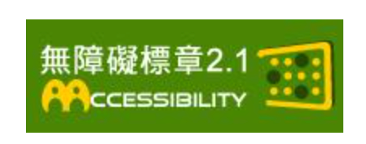

# 🔌 方法三：使用 MCP 連接器審查結構

[⬅️ 上一章：方法二 (提供 URL 分析)](./02_提供URL分析.md) ｜ [🏠 返回網站評估主頁](./README.md)

---

當你需要對網頁進行更深入的技術層面評估（例如：HTML 標籤結構、無障礙規範、SEO 代碼優化、資訊安全）時，使用 **Chrome DevTools MCP / claude.ai 連接器** 能為 AI 提供強大的「超級工程師視角」。

AI 會接管你的瀏覽器，直接分析渲染完成的 DOM 樹、實時 CSS 樣式、Console 日誌與網絡傳輸，比普通的網址或文字抓取更為深入且精準。

---

### 🔌 claude.ai 網頁版連接器 (Connectors) 設定指引

你不需要安裝額外的開發工具或編寫 JSON 設定檔，直接在 `claude.ai` 網頁版中啟用連接器，就能連線並操控你的 Chrome 瀏覽器：

1. **開啟連接器目錄**：登入並開啟 `claude.ai` 網頁版，在對話框中點選 **「Directory (工具與連接器目錄)」**。
2. **搜尋 Chrome 連接器**：選擇左側的 **Connectors**，並在上方搜尋框中輸入 `chrome`。
3. **新增連接器**：
   * 找到 **Control Chrome**，點擊右側的 **`+`** 按鈕進行安裝與啟用。
4. **授權連結**：根據網頁提示，完成本地瀏覽器的連結授權。
5. **開始發問**：啟用後，你可以直接在對話框中命令網頁版 Claude，例如：「*請幫我開啟自來水公司官網並評估其無障礙規範。*」

> [!WARNING]
> ⚠️ **新手注意：請看清 `Claude in Chrome` 與 `Control Chrome` 的差別！**
> 在設定選單中，你會看到這兩個相似的名稱，請**務必選擇 `Control Chrome`**：
> * **❌ Claude in Chrome**：這個工具是透過 **Claude Desktop (桌面版軟體)** 來操控瀏覽器，它會要求你下載並安裝電腦桌面版應用程式。為了免去繁雜的安裝步驟，我們**不使用這個**。
> * **✅ Control Chrome**：這個才是我們要用的！它是一個純網頁版的連接器，讓你的 `claude.ai` 網頁對話框直接讀取目前瀏覽器分頁的 DOM 與代碼，**完全不需要安裝任何桌面版軟體**，最適合學生快速上手！

---

### 💡 Q&A 進階探討：只給網址，AI 能切換到「工程師視角」嗎？DevTools MCP 如何顛覆這個限制？

#### Q1. 如果我只提供「網址 (URL)」，AI 網頁版有辦法用工程師視角評估嗎？
**答案是：效果非常有限，甚至經常會失敗。**
* **動態渲染與反爬蟲限制**：一般的聯網 AI 抓取器（Crawler）通常只能抓取網頁的「靜態 HTML」或「純文字」。對於現代使用 React/Vue 等框架動態渲染的單頁應用（SPA），或是設有 Cloudflare 等防爬蟲機制的網頁，外部 AI 無法抓到真實渲染後的 DOM 結構與 CSS。
* **登入牆限制**：如果需要評估的頁面需要登入（例如選課系統、後台管理），外部 AI 抓取器無法越過安全驗證進入。
因此，在一般網頁版 AI 中，必須依靠 **MCP 連接器（方法三）** 直接從瀏覽器內部讀取渲染後的程式碼。

#### Q2. 我們可以利用 AI 配合「DevTools MCP / 連接器」做到什麼事？
**這正是現代 AI 協作（AI Agent）最強大的「超級工程師視角」：**
* **解析動態 DOM 與 CSS**：AI 能直接從瀏覽器內部讀取渲染完成的 DOM 樹與實時 CSS 樣式。
* **讀取 Console 與 Network 資訊**：AI 可以主動檢查 Console 面板中是否有錯誤日誌，或監控 Network 面板，看哪一個 API 請求載入太慢或有傳輸資安漏洞。
* **無障礙 (A11y) 與效能自動稽核**：AI 能自動在瀏覽器中運行 **Lighthouse**，直接讀取無障礙樹 (Accessibility Tree)，精確診斷對比度不足或標籤不正確的問題，並直接給予修復建議。

---

## 📝 實用 AI 評估 Prompt 模板 (搭配連接器)

啟用連接器後，請直接對 Claude 發送以下 Prompt 來對目標網址進行進階指標審查：

### 1. ♿ 無障礙網頁評估 (Accessibility / A11y)



> 💡 **認識「網站無障礙規範 2.1」：**
> * **什麼是無障礙網頁？**：旨在確保身心障礙者與高齡長輩在瀏覽網站時，能毫無障礙地平等獲取資訊（例如：視障朋友使用螢幕朗讀軟體讀取網頁）。
> * **標章規範背景**：台灣「網站無障礙規範」是參考全球資訊網協會（W3C）的 **WCAG 2.1** 國際標準而訂定，目前由數位發展部推動管理。
> * **常見標章等級**：
>   * **A 級（最基礎）**：基本必備無障礙設計。
>   * **AA 級（公部門/學校基本標準）**：包含所有 A 級規範，並特別強化了行動裝置、色彩對比度及複雜互動的無障礙性，是目前公部門與多數企業申請標章時的主要目標。
>   * **AAA 級（最高等級）**：提供最佳體驗，但建置門檻極高。
> * **為什麼需要 AI / 連接器輔助審查？**：無障礙檢測需要分析底層的 HTML 結構，例如圖片是否配有 `alt` 替代文字、標題階層是否正確。這正是使用 MCP 連接器讓 AI 作為「超級工程師」直接讀取 DOM 骨架時，最能發揮威力之處。

> [!TIP]
> 🎯 **推薦實作範例：台灣自來水公司官網**
> * **評估重點**：自來水公司作為公用事業網站，有取得無障礙標章的法規要求。學生可以讓 AI 連接器掃描其網頁 DOM 樹，檢查是否仍有「漏掉替代文字 (alt) 的促銷橫幅」、色彩對比度是否對視障朋友友善。
> * **練習網址**：`https://www.water.gov.tw/`
> * **操作方式**：在對話中呼叫連接器開啟上方網址，並發送下方 Prompt。

> **重要性**：公部門網站必須符合「網站無障礙規範」取得標章，企業網站亦以此提升社會責任（ESG）與包容性（推薦使用：台灣自來水公司官網）。  
> **最佳評估方式**：在對話中呼叫 **Control Chrome** 讀取 DOM。

```markdown
# 任務
請使用連接器開啟網址 [請貼上網址]，並以無障礙網頁設計審查員的角度，評估網頁是否符合 WCAG 2.1 AA 等級規範。

# 請使用連接器讀取 DOM 並檢查：
1. 是否有遺漏的圖片 alt 屬性？如果有，請根據上下文給出建議的 alt 描述。
2. 文字與背景的色彩對比度是否足夠？（分析按鈕色與文字色）
3. 標題層級 (`<h1>` - `<h6>`) 結構是否正確嵌套？
4. 是否具備良好的鍵盤焦點指示（Focus State）？
```

### 2. 🔍 搜尋引擎優化評估 (SEO)

> [!TIP]
> 🎯 **推薦實作範例：雄獅旅遊官網**
> * **評估重點**：大型民營旅遊網站在 SEO 上有極高的流量競爭需求。學生可以讓 AI 讀取其 `head` 內的 TDK 設定與標題 `<h1>` 層級，分析是否存在「標題重複、關鍵字堆疊、缺少描述標籤」等問題，並讓 AI 生成優化後的代碼。
> * **練習網址**：`https://www.liontravel.com/`
> * **操作方式**：在對話中呼叫連接器開啟上方網址，並發送下方 Prompt。

> **重要性**：決定網站能否在 Google 搜尋中被大眾找到，提升公共服務與重要資訊的觸及率（推薦使用：雄獅旅遊官網）。

```markdown
# 任務
請使用連接器開啟網址 [請貼上網址]，並作為資深 SEO 專家對其代碼與結構進行分析。

# 請使用連接器讀取並提供：
1. **TDK 優化**：讀取目前的 Title 與 Meta Description，重新撰寫一個高點擊率、包含關鍵字的標題（建議 30 字內）與描述（建議 150 字內）。
2. **標題階層審查**：目前的 `<h1>` 標籤使用是否正確？（每個頁面應只有一個 `<h1>`）
3. **結構化資料**：網頁中是否有設置 Schema Markup 讓搜尋引擎辨識？
```

### 3. 🔒 網站資訊安全評估 (Security)

> [!TIP]
> 🎯 **推薦實作範例：台灣高鐵官網**
> * **評估重點**：涉及票務訂購與敏感個資（身分證、信用卡等）填寫的交易網站，其安全性是最高指標。學生可以讓 AI 分析其網址傳輸協議、表單欄位的前端防護（如敏感欄位是否明碼顯示）、以及網絡響應頭是否設置了安全防禦標頭。
> * **練習網址**：`https://www.thsrc.com.tw/`
> * **操作方式**：在對話中呼叫連接器開啟上方網址，並發送下方 Prompt。

> **重要性**：保護使用者隱私與防止網站被惡意入侵，是公部門與企業網站的最高指標（推薦使用：台灣高鐵官網）。

```markdown
# 任務
請使用連接器開啟網址 [請貼上網址]，對該網頁的前端表單、網絡請求（Network）進行資安初步審查。

# 請使用連接器檢查並指出：
1. 傳輸安全：是否全面強制使用 HTTPS？
2. 輸入防護：前端表單欄位輸入是否存在潛在的安全漏洞（如：缺乏前端驗證、敏感資訊洩漏）？
3. Network 標頭：檢查網絡響應頭（Security Headers）是否有配置防範 XSS 或點擊劫持（Clickjacking）的防護？
4. 請提供具體的安全優化建議。
```

---

<details>
<summary>🌐 點此展開：推薦評估練習網站名單 (適合學生實作)</summary>
<br/>

為了讓學生不需要花費大量時間尋找「介面有待優化（資訊過於繁雜或設計較舊）」的網站，以下整理了幾個非常適合作為 UI/UX 評估與改版練習的繁體中文網站：

| 網站名稱 | 類型 | 網址連結 | UI/UX 觀察要點 (學生可切入的痛點) |
| :--- | :--- | :--- | :--- |
| **台灣高鐵 (THSR)** | 交通運輸與票務系統 | [點此前往](https://www.thsrc.com.tw/) | 首頁的票務查詢與線上訂票系統是核心功能，適合評估「購票與車次查詢的任務流程動線（User Flow）」以及訂票流程中的「防呆與指引設計（如驗證碼、座位選擇）」。 |
| **雄獅旅遊 (Lion Travel)** | 旅遊服務平台 | [點此前往](https://www.liontravel.com/) | 首頁涵蓋極多不同類型的行程與促銷模組、搜尋控制項複雜，適合評估「主要動線（搜尋與訂購流程）流暢度」與「首頁視覺呼吸感」。 |
| **104 人力銀行** | 招募與求職平台 | [點此前往](https://www.104.com.tw/) | 履歷填寫流程長、進階搜尋條件眾多，適合練習「複雜表單的易用性設計（無縫步驟）」與「資訊階層分類」。 |
| **台灣自來水公司** | 民生公用事業 | [點此前往](https://www.water.gov.tw/) | 版面留白不足、廣告 Banner 與最新消息雜亂、核心焦點不夠突出，適合進行「版型佈局與視覺呼吸感」的重構練習。 |
| **各校園舊版選課/入口系統** | 校園系統 | *(可請學生直接使用自己學校的選課/課表系統)* | 普遍有著表格文字過密、按鈕過小、行動裝置完全不相容（非 RWD）的痛點，最適合練習「行動版網頁（Mobile RWD）設計」。 |

> [!TIP]
> 這些網站大多具備**強大的實用性與功能性**，但因為歷史包袱或資訊雜亂，在**視覺美學與操作流暢度**上還有極大的進步空間，是學生練習「Before / After」對比改版原型的完美素材！
</details>

---

[⬅️ 上一章：方法二 (提供 URL 分析)](./02_提供URL分析.md) ｜ [🏠 返回網站評估主頁](./README.md)
