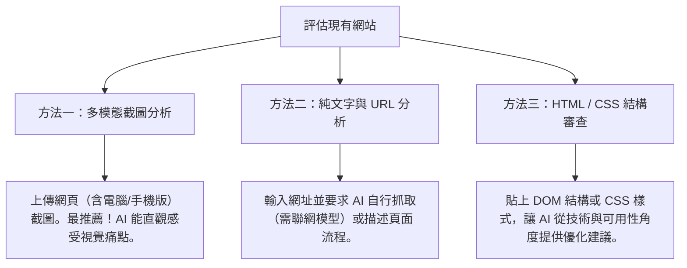

# 如何透過 AI 評估現有網站的 UI/UX

在進行網站改版或優化前，了解現有網站的痛點是至關重要的第一步。傳統的 UI/UX 評估（例如：使用者測試、焦點小組、人工啟發式評估）通常需要耗費大量的時間與資源。

如今，透過**多模態 AI（Multimodal AI）**的協助，專案管理員與設計師可以在幾分鐘內，對現有網站進行客觀、全面且符合現代設計規範的 UI/UX 檢測。

---

## 💡 為什麼要用 AI 評估網站 UI/UX？

> [!NOTE]
> AI 不是要取代專業的設計決策，而是扮演**「超高效的客製化設計顧問」**，提供客觀、基於數據與業界標準的優化建議。

| 優勢維度 | 說明 |
| :--- | :--- |
| **客觀啟發式分析** | AI 可以基於 **Nielsen 10 大網頁可用性原則（Heuristics）**，逐一檢查網頁細節，避免人為盲點。 |
| **多模態視覺判讀** | 現代 AI（如 Claude 3.5 Sonnet, GPT-4o）能直接「看懂」網頁截圖，判斷色彩對比度、排版層級、視覺焦距。 |
| **程式碼結構優化** | 可以將前端 HTML/CSS 提供給 AI，檢查語意化標籤（Semantic HTML）與無障礙網頁規範（A11y）。 |
| **快速產生改版建議** | 不僅指出問題，還能立即產出修改方針、新版的 Prompt，甚至直接生成重構後的頁面程式碼。 |

---

## 🛠️ 評估網站的三大 AI 技巧

要讓 AI 給出精準的 UI/UX 評估，應根據您所擁有的資訊，選擇合適的提供方式：



---

## 📝 實用 AI 評估 Prompt 模板

以下提供三個由淺入深的 Prompt 模板，請依照您的需求複製使用：

### 1. 全方位 UI/UX 啟發式評估 (整體健康檢查)
> **使用情境**：適合剛接手新專案，需要對舊網站做全面性健檢時。
> **操作方式**：將網站首頁的截圖（含頂部導覽列、主視覺、底部資訊）上傳至 AI，並發送以下 Prompt。

```markdown
# 角色與任務
你是一位具備 10 年經驗的資深 UI/UX 設計專家與網頁可用性審查員。請根據我提供的網頁截圖，針對該網站進行全面的 UI/UX 評估。

# 評估維度
請基於「尼爾森十大可用性啟發原則」(Nielsen's 10 Usability Heuristics) 與現代 Web 設計最佳實踐，評估以下面向：
1. 系統狀態的顯著性 (如導覽列與麵包屑是否明確)
2. 系統與真實世界的關聯 (字彙與排版是否符合直覺)
3. 使用者的控制與自主性 (是否容易回退、跳過)
4. 一致性與標準 (元件、色彩、按鈕樣式是否統一)
5. 防錯與防呆設計 (輸入框與表單的流暢度)
6. 視覺與極簡設計 (是否有不必要的雜訊、干擾)

# 輸出格式
請用結構化的 Traditional Chinese（繁體中文）回答：
- 🔍 **核心痛點分析**：列出最嚴重的 3-5 個 UI/UX 致命傷。
- 💡 **優化建議**：針對每個痛點，提供具體的改進做法與視覺佈局建議。
- ⭐ **評分（1-10分）**：整體易用性評分。
```

### 2. 視覺與排版美學審查 (視覺層級強化)
> **使用情境**：網站功能沒問題，但被抱怨「看起來很陽春」、「找不到重點」、「配色混亂」。
> **操作方式**：上傳截圖，並發送以下 Prompt。

```markdown
# 任務
請評估此網頁的「視覺設計層級 (Visual Hierarchy)」與「美學風格」。

# 審查重點
1. **配色系統**：色彩搭配是否和諧？是否有過多無意義的顏色？主色與強調色是否能引導用戶視線？
2. **文字排版 (Typography)**：字型大小、字重（Weight）、行距與段落間距是否合適？閱讀起來是否吃力？
3. **區塊呼吸感 (Whitespace)**：是否有足夠的留白？資訊是否過度擁擠？
4. **行動呼籲 (CTA)**：主要按鈕（如註冊、購買、立即預約）是否夠醒目？

請指出目前視覺上的盲點，並提供一份更符合現代設計風格（如：極簡主義、大留白、層次分明的字級）的優化調色盤與字級規劃建議。
```

### 3. 操作動線與流暢度評估 (轉換率優化)
> **使用情境**：電子商務、報名表單、註冊流程等需要「轉換率」的網站。
> **操作方式**：上傳整個流程的連續截圖，並發送以下 Prompt。

```markdown
# 任務
你是一位轉換率優化 (CRO) 專家與 UX 設計師。請評估此操作流程的「使用者路徑阻力」。

# 評估項目
1. 欄位是否過多？有沒有可以簡化或合併的步驟？
2. 在填寫過程中，使用者是否容易感到困惑或迷路？
3. 介面上是否有足夠的輔助說明或即時驗證回饋？
4. 點擊目標（按鈕、連結）在行動裝置上是否足夠大且容易點擊？

請提供一個「無縫式步驟 (Seamless Flow)」的優化方案，說明如何透過減少頁面切換或優化輸入表單來提升轉換率。
```

---

## 🎯 案例實作：政府網站的 UI/UX 改版評估

台灣許多政府網站因資訊繁雜，常是絕佳的練習與改版範例。以下是利用 AI 評估的實踐路徑：

### 案例一：[中華民國國防部 官方網站](https://www.mnd.gov.tw/default.aspx)
* **舊站主要問題**：資訊量極大、全域與區域導覽列層級複雜、視覺元素較為傳統、對行動裝置（RWD）的適應性有優化空間。
* **AI 評估焦點**：
  * **資訊減量**：請 AI 分析首頁哪些區塊屬於重複或低點擊率資訊，如何進行「極簡化」歸類。
  * **首頁佈局**：建議將多欄式的複雜版面改為現代的「單欄/雙欄格狀佈局」，強化首要防衛與即時新聞的閱讀動線。

### 案例二：[財政部電子申報繳稅服務網](https://tax.nat.gov.tw)
* **舊站主要問題**：報稅季流量極高，但操作流程對一般民眾而言專業術語較多、表單繁瑣。
* **AI 評估焦點**：
  * **無縫式步驟**：評估如何將報稅從「跳轉多頁面」改為「無縫式步驟介面 (Progressive Steps)」。
  * **防錯機制**：請 AI 設計一個在填寫錯誤時，能進行即時防呆與引導提示的對話框介面。

---

## 🚀 評估後的下一步：如何快速重建原型？

當 AI 幫您指出網站的缺點並給出具體建議後，您可以利用以下步驟，**無縫過渡到原型設計**：

1. **萃取評估報告**：
   將 AI 給您的優化建議，轉化為具體的設計特徵。例如：「將首頁改為雙欄佈局，左側為焦點新聞，右側為常用申辦服務捷徑；色彩主色調改為深藍色，搭配暖橘色作為強調色。」
2. **生成改版 Prompt**：
   將這些特徵寫入 `ai輔助/README.md` 中介紹的【進階版 Prompt 模板】。
3. **送入原型生成工具**：
   將 Prompt 輸入 **Framer AI**、**v0.dev** 或 **Uizard**，瞬間即可生成新版的網站視覺原型與 HTML/CSS 程式碼。

> [!TIP]
> 善用這個「評估 ➡️ 產生建議 ➡️ 寫成 Prompt ➡️ 快速生成原型」的黃金循環，您能在一天內完成過去需要兩週溝通才能得出的改版初稿！
