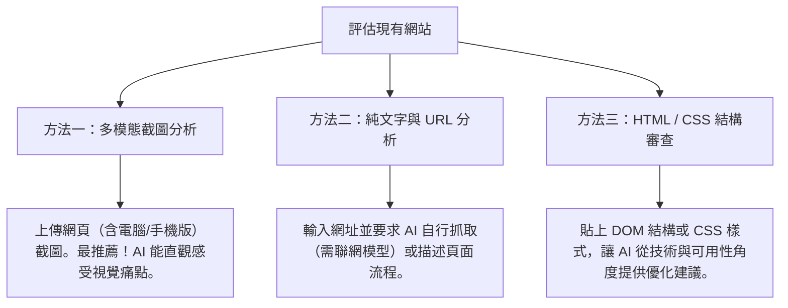

# 如何透過 AI 評估現有網站的 UI/UX

在進行網站改版或優化前，了解現有網站的痛點是至關重要的第一步。傳統的 UI/UX 評估（例如：使用者測試、焦點小組、人工啟發式評估）通常需要耗費大量的時間與資源。

如今，透過**多模態 AI（Multimodal AI）**的協助，專案管理員與設計師可以在幾分鐘內，對現有網站進行客觀、全面且符合現代設計規範的 UI/UX 檢測。

---

## 💡 為什麼要用 AI 評估網站 UI/UX？

> [!NOTE]
> AI 不是要取代專業的設計決策，而是扮演**「超高效的客製化設計顧問」**，提供客觀、基於數據與業界標準的優化建議。

| 優勢維度 | 說明 |
| :--- | :--- |
| **客觀啟發式分析** | AI 可以基於雅各·尼爾森（Jakob Nielsen）提出的 [10 大網頁可用性原則 (10 Usability Heuristics)](https://www.nngroup.com/articles/ten-usability-heuristics/)，逐一檢查網頁的系統狀態、一致性與容錯設計等細節，避免人為盲點。 |
| **多模態視覺判讀** | 現代 AI（如 Claude 3.5 Sonnet, GPT-4o）能直接「看懂」網頁截圖，判斷色彩對比度、排版層級、視覺焦距。 |
| **程式碼結構優化** | 可以將前端 HTML/CSS 提供給 AI，檢查語意化標籤（Semantic HTML）與無障礙網頁規範（A11y）。 |
| **快速產生改版建議** | 不僅指出問題，還能立即產出修改方針、新版的 Prompt，甚至直接生成重構後的頁面程式碼。 |

---

## 🛠️ 評估網站的三大 AI 技巧

要讓 AI 給出精準的 UI/UX 評估，應根據您所擁有的資訊，選擇合適的提供方式：



### 📸 技巧：如何快速取得網頁的「整頁長截圖」？

由於 UI/UX 評估極度依賴整體的視覺佈局與引導動線，上傳**「整頁長截圖」**（包含需要滾動才能看到的下方內容）能提供 AI 最完整、最真實的版面資訊。

你可以使用瀏覽器內建的功能，無需安裝任何擴充套件：

> [!TIP]
> **Chrome / Edge 內建整頁截圖步驟：**
> 1. 開啟要評估的網頁，按 `F12`（或按右鍵點擊「檢查」）開啟開發者工具。
> 2. 按下快捷鍵 `Ctrl + Shift + P`（Mac 用戶請按 `Cmd + Shift + P`）開啟快速指令選單。
> 3. 輸入 `screenshot`，然後選擇 **「Capture full size screenshot」**（擷取完整大小螢幕截圖）。
> 4. 整個網頁將會自動下載並存成一個 PNG 圖片。
>
> 這種方法能抓取「整個頁面」（包含需要捲動才看得到的部分），最適合給 AI 評估 UI/UX，因為一次就有完整的版面。

---

## 📝 實用 AI 評估 Prompt 模板

以下提供三個由淺入深的 Prompt 模板，請依照您的需求複製使用：

### 1. 全方位 UI/UX 啟發式評估 (整體健康檢查)
> **使用情境**：適合剛接手新專案，需要對舊網站做全面性健檢時。
> **操作方式**：將網站首頁的截圖（含頂部導覽列、主視覺、底部資訊）上傳至 AI，並發送以下 Prompt。

```markdown
# 角色與任務
你是一位具備 10 年經驗的資深 UI/UX 設計專家與網頁可用性審查員。請根據我提供的網頁截圖，針對該網站進行全面的 UI/UX 評估。

# 評估維度
請基於「尼爾森十大可用性啟發原則」(Nielsen's 10 Usability Heuristics) 與現代 Web 設計最佳實踐，評估以下面向：
1. 系統狀態的顯著性 (如導覽列與麵包屑是否明確)
2. 系統與真實世界的關聯 (字彙與排版是否符合直覺)
3. 使用者的控制與自主性 (是否容易回退、跳過)
4. 一致性與標準 (元件、色彩、按鈕樣式是否統一)
5. 防錯與防呆設計 (輸入框與表單的流暢度)
6. 視覺與極簡設計 (是否有不必要的雜訊、干擾)

# 輸出格式
請用結構化的 Traditional Chinese（繁體中文）回答：
- 🔍 **核心痛點分析**：列出最嚴重的 3-5 個 UI/UX 致命傷。
- 💡 **優化建議**：針對每個痛點，提供具體的改進做法與視覺佈局建議。
- ⭐ **評分（1-10分）**：整體易用性評分。
```

### 2. 視覺與排版美學審查 (視覺層級強化)
> **使用情境**：網站功能沒問題，但被抱怨「看起來很陽春」、「找不到重點」、「配色混亂」。
> **操作方式**：上傳截圖，並發送以下 Prompt。

```markdown
# 任務
請評估此網頁的「視覺設計層級 (Visual Hierarchy)」與「美學風格」。

# 審查重點
1. **配色系統**：色彩搭配是否和諧？是否有過多無意義的顏色？主色與強調色是否能引導用戶視線？
2. **文字排版 (Typography)**：字型大小、字重（Weight）、行距與段落間距是否合適？閱讀起來是否吃力？
3. **區塊呼吸感 (Whitespace)**：是否有足夠的留白？資訊是否過度擁擠？
4. **行動呼籲 (CTA)**：主要按鈕（如註冊、購買、立即預約）是否夠醒目？

請指出目前視覺上的盲點，並提供一份更符合現代設計風格（如：極簡主義、大留白、層次分明的字級）的優化調色盤與字級規劃建議。
```

### 3. 操作動線與流暢度評估 (轉換率優化)
> **使用情境**：電子商務、報名表單、註冊流程等需要「轉換率」的網站。
> **操作方式**：上傳整個流程的連續截圖，並發送以下 Prompt。

```markdown
# 任務
你是一位轉換率優化 (CRO) 專家與 UX 設計師。請評估此操作流程的「使用者路徑阻力」。

# 評估項目
1. 欄位是否過多？有沒有可以簡化或合併的步驟？
2. 在填寫過程中，使用者是否容易感到困惑或迷路？
3. 介面上是否有足夠的輔助說明或即時驗證回饋？
4. 點擊目標（按鈕、連結）在行動裝置上是否足夠大且容易點擊？

請提供一個「無縫式步驟 (Seamless Flow)」的優化方案，說明如何透過減少頁面切換或優化輸入表單來提升轉換率。
```

---

## 🛡️ 網站管理員必修：如何透過 AI 評估 SEO、無障礙與安全性

對於網站專案管理員（特別是公部門與企業管理員）而言，一個成功的網站除了具備優良的 UI/UX，還必須滿足 **無障礙規範 (Accessibility)**、**搜尋引擎優化 (SEO)** 與 **資訊安全 (Security)**。這三個維度同樣可以透過 AI 進行高效率的初步審查。

---

### 1. ♿ 無障礙網頁評估 (Accessibility / A11y)
> **重要性**：公部門網站必須符合「國家通訊傳播委員會 (NCC) 國家無障礙網頁規範」，企業網站亦以此提升社會責任（ESG）與包容性。

* **AI 審查重點**：
  * **替代文字 (Alt Text)**：檢查所有圖片是否有具意義的描述。
  * **色彩對比度 (Contrast Ratio)**：檢查文字與背景色的對比是否達到 4.5:1 (AA級) 或 7:1 (AAA級) 以上。
  * **鍵盤操作性 (Keyboard Focus)**：僅使用鍵盤（Tab鍵）是否能順利導覽整個網頁。
  * **語意化 HTML (Semantic Structure)**：標題層級 (`<h1>`-`<h6>`) 是否符合巢狀順序，而非單純用來調整字型大小。

* **實用 AI 提示詞 (A11y 審查)**：
  ```markdown
  # 任務
  請以無障礙網頁設計審查員的角度，評估以下 HTML 程式碼片段（或網頁視覺截圖）是否符合 WCAG 2.1 (Web Content Accessibility Guidelines) AA 等級規範。
  
  # 請檢查並指出：
  1. 是否有遺漏的圖片 alt 屬性？如果有，請根據上下文給出建議的 alt 描述。
  2. 文字與背景的色彩對比度是否足夠？（請分析按鈕色與文字色）
  3. 標題層級 (`<h1>` - `<h6>`) 結構是否正確？
  4. 是否具備良好的鍵盤焦點指示（Focus State）？
  ```

---

### 2. 🔍 搜尋引擎優化評估 (SEO)
> **重要性**：決定網站能否在 Google 搜尋中被大眾找到，這對於政令宣導、公共服務資訊的觸及率至關重要。

* **AI 審查重點**：
  * **Meta 標籤**：網頁的 `<title>` 和 `<meta name="description">` 是否足夠吸引人且包含關鍵字。
  * **響應式設計 (RWD)**：行動版與電腦版的內容是否一致（Google 採行動優先索引）。
  * **內容結構與關鍵字**：網頁內容是否有清楚的標題階層，並自然地包含目標搜尋詞彙。
  * **結構化資料 (Schema Markup)**：是否提供結構化資料讓 Google 呈現複合式搜尋結果。

* **實用 AI 提示詞 (SEO 優化)**：
  ```markdown
  # 任務
  你是一位資深 SEO 專家。請分析以下網頁原始碼（或網頁文字內容），並提供優化建議：
  
  # 請提供：
  1. **TDK 優化**：針對目前的網頁內容，重新撰寫一個高點擊率、包含關鍵字的 Title（建議 30 字內）與 Description（建議 150 字內）。
  2. **標題階層審查**：目前的 `<h1>` 標籤使用是否正確？（每個頁面應只有一個 `<h1>`）
  3. **關鍵字佈局**：內容中關鍵字的分布是否合理？有何補強建議？
  ```

---

### 3. 🔒 網站資訊安全評估 (Security)
> **重要性**：保護使用者隱私與防止網站被惡意入侵，公部門與企業網站對資安的要求均為最高標準。

* **AI 審查重點**：
  * **傳輸安全**：確認網站是否全面強制使用 HTTPS 加密協定。
  * **輸入驗證與防範**：表單輸入框是否採取防護措施，防止跨網站指令碼 (XSS) 或 SQL 注入 (SQLi)。
  * **敏感資訊暴露**：網頁前端是否洩漏了後端伺服器版本、API 金鑰或內部資料庫結構。
  * **身分驗證機制**：登入與密碼輸入介面是否採用安全傳輸與防暴力破解設計。

* **實用 AI 提示詞 (資安初步代碼審查)**：
  ```markdown
  # 任務
  你是一位資深白帽駭客與網頁資安專家。請針對我提供的表單 HTML/JS 代碼（或登入流程截圖）進行資安弱點分析：
  
  # 請指出：
  1. 介面與欄位輸入上是否存在潛在的安全漏洞（例如：缺乏前端驗證、密碼明文傳輸、敏感資訊洩漏）？
  2. 是否有違反安全最佳實踐（OWASP Top 10）的地方？
  3. 請提供具體的安全重構建議。
  ```

---

## 🌐 推薦評估練習網站名單 (適合學生實作)

為了讓學生不需要花費大量時間尋找「介面有待優化（資訊過於繁雜或設計較舊）」的網站，以下整理了幾個非常適合作為 UI/UX 評估與改版練習的繁體中文網站：

| 網站名稱 | 類型 | 網址連結 | UI/UX 觀察要點 (學生可切入的痛點) |
| :--- | :--- | :--- | :--- |
| **台灣高鐵 (THSR)** | 交通運輸與票務系統 | [點此前往](https://www.thsrc.com.tw/) | 首頁的票務查詢與線上訂票系統是核心功能，適合評估「購票與車次查詢的任務流程動線（User Flow）」以及訂票流程中的「防呆與指引設計（如驗證碼、座位選擇）」。 |
| **雄獅旅遊 (Lion Travel)** | 旅遊服務平台 | [點此前往](https://www.liontravel.com/) | 首頁涵蓋極多不同類型的行程與促銷模組、搜尋控制項複雜，適合評估「主要動線（搜尋與訂購流程）流暢度」與「首頁視覺呼吸感」。 |
| **104 人力銀行** | 招募與求職平台 | [點此前往](https://www.104.com.tw/) | 履歷填寫流程長、進階搜尋條件眾多，適合練習「複雜表單的易用性設計（無縫步驟）」與「資訊階層分類」。 |
| **台灣自來水公司** | 民生公用事業 | [點此前往](https://www.water.gov.tw/) | 版面留白不足、廣告 Banner 與最新消息雜亂、核心焦點不夠突出，適合進行「版型佈局與視覺呼吸感」的重構練習。 |
| **各校園舊版選課/入口系統** | 校園系統 | *(可請學生直接使用自己學校的選課/課表系統)* | 普遍有著表格文字過密、按鈕過小、行動裝置完全不相容（非 RWD）的痛點，最適合練習「行動版網頁（Mobile RWD）設計」。 |


> [!TIP]
> 這些網站大多具備**強大的實用性與功能性**，但因為歷史包袱或資訊龐雜，在**視覺美學與操作流暢度**上還有極大的進步空間，是學生練習「Before / After」對比改版原型的完美素材！

---

## 🚀 評估後的下一步：如何快速重建原型？

當 AI 幫您指出網站的缺點並給出具體建議後，您可以利用以下步驟，**無縫過渡到原型設計**：

1. **萃取評估報告**：
   將 AI 給您的優化建議，轉化為具體的設計特徵。例如：「將首頁改為雙欄佈局，左側為焦點新聞，右側為常用申辦服務捷徑；色彩主色調改為深藍色，搭配暖橘色作為強調色。」
2. **生成改版 Prompt**：
   將這些特徵寫入 `ai輔助/README.md` 中介紹的【進階版 Prompt 模板】。
3. **送入原型生成工具**：
   將 Prompt 輸入 **Framer AI**、**v0.dev** 或 **Uizard**，瞬間即可生成新版的網站視覺原型與 HTML/CSS 程式碼。

> [!TIP]
> 善用這個「評估 ➡️ 產生建議 ➡️ 寫成 Prompt ➡️ 快速生成原型」的黃金循環，您能在一天內完成過去需要兩週溝通才能得出的改版初稿！
