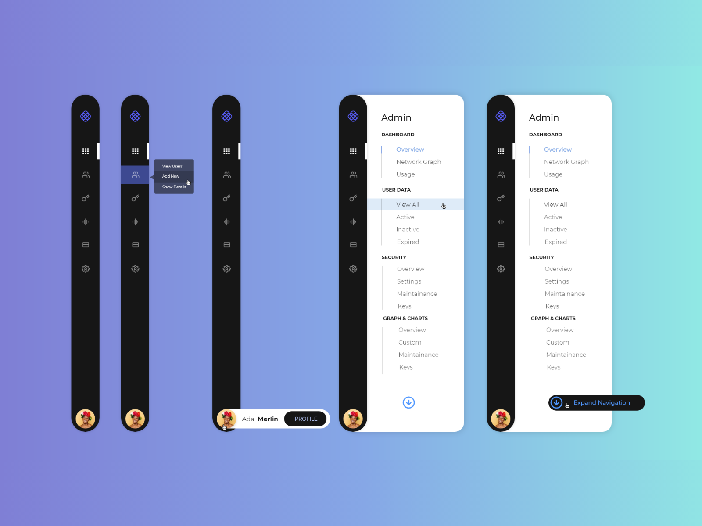
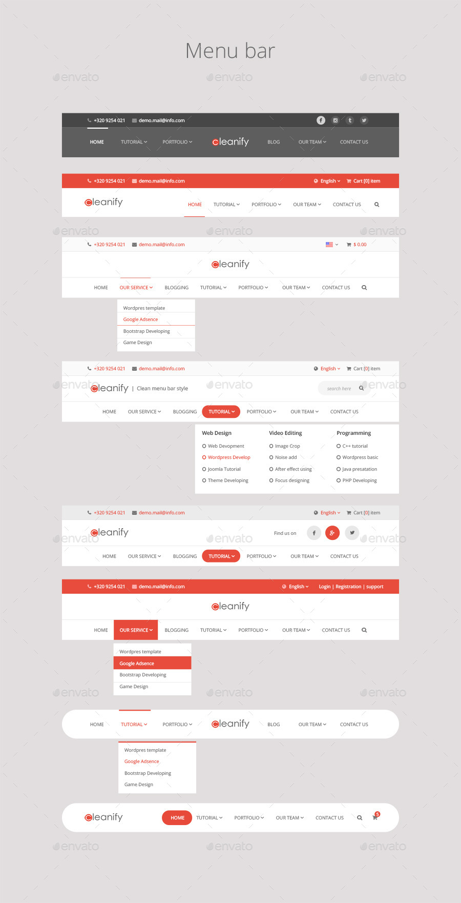
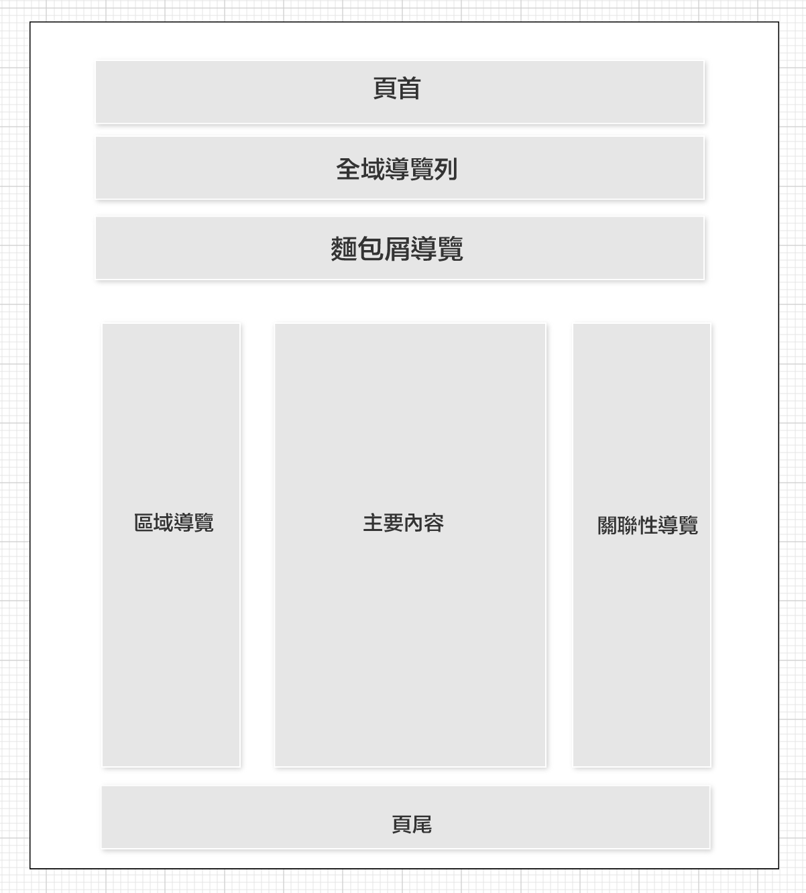
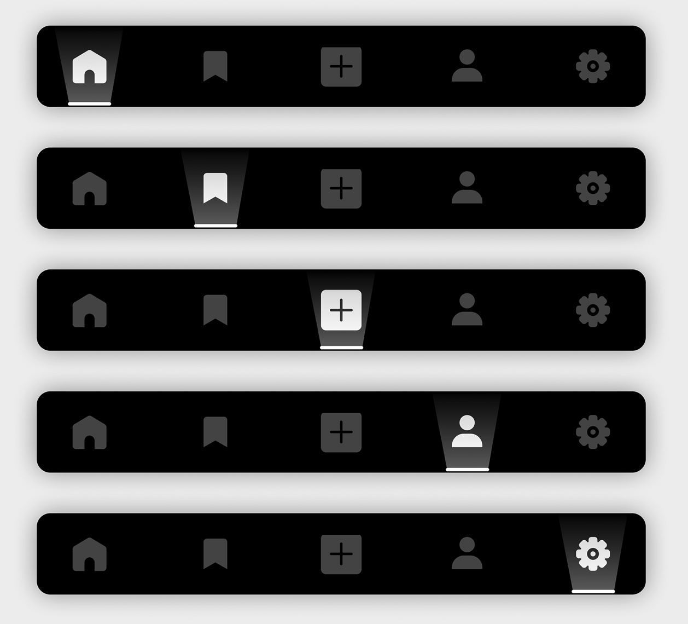
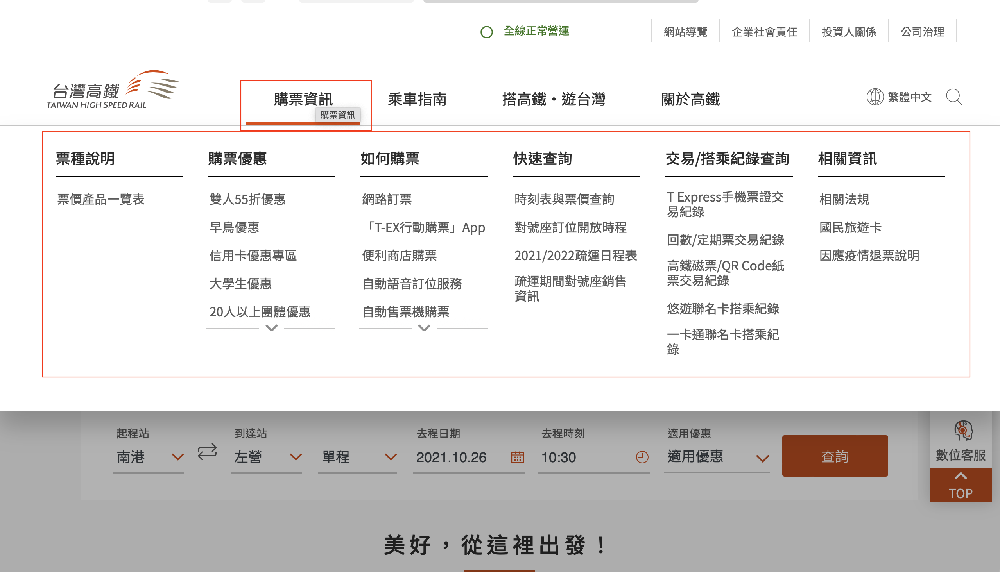
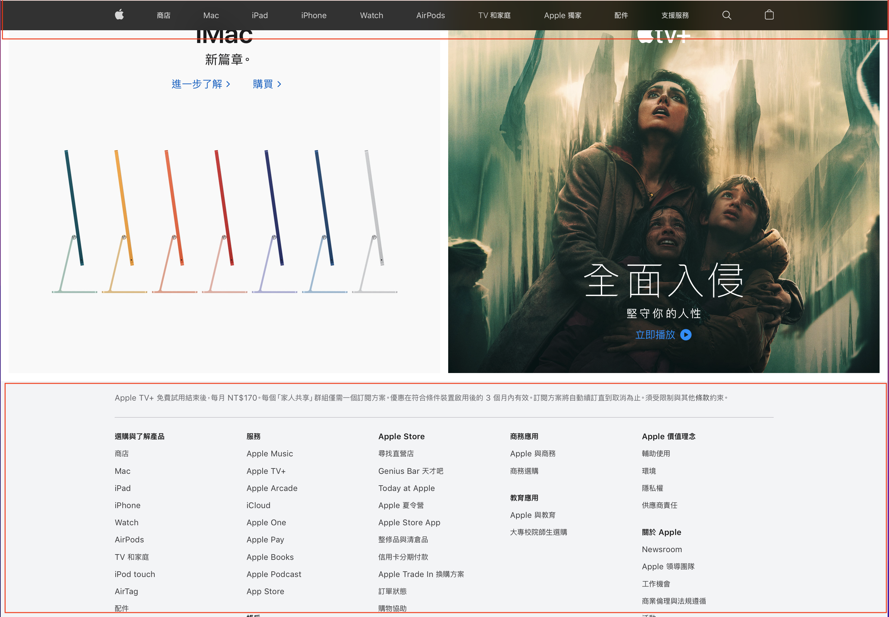
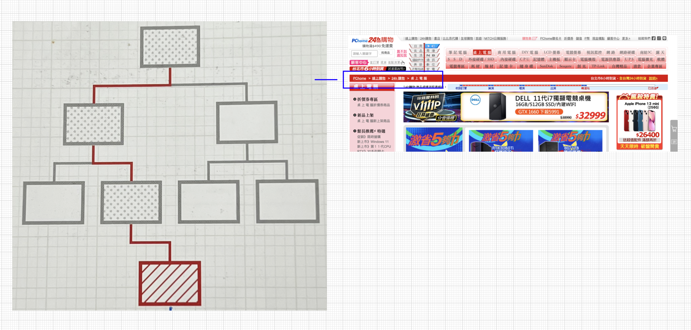
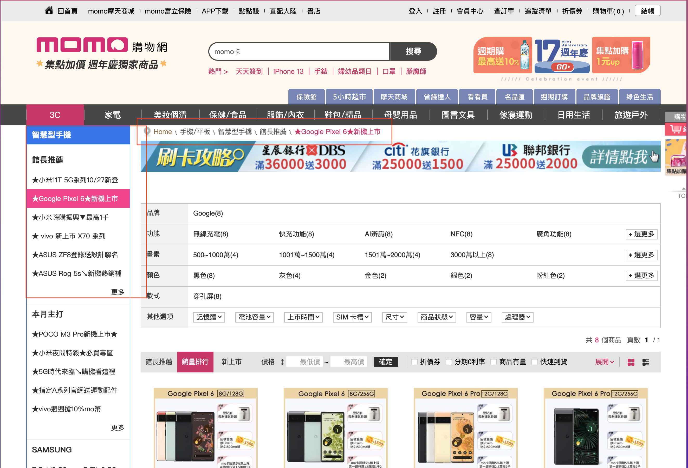
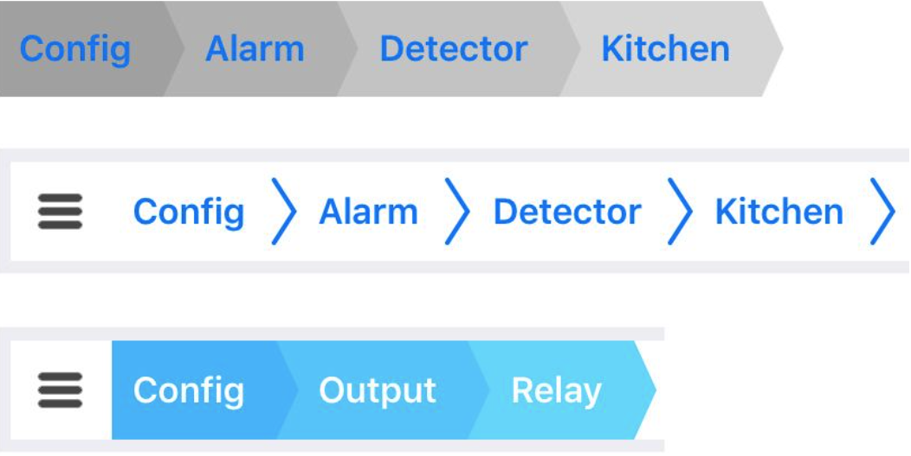

# Chapter1 網站架構(websize architecture)

## 導覽列
1. ## 導覽列扮演的角色  
### 達成某種目的的手段
導覽列是一種提供給使用者的操作體系，可讓使用者了解頁面的位置關係與移動方式，而
且其操作方式具有一貫性。設計精良的導覽列系統可提醒使用者目前的所在頁面，也能讓做用者明白接下來還能去哪個頁面，因此能讓使用者感受到網站與應用程式的價值。

只要能了解目前的所在頁面，應該就能了解該頁面與其他頁面之間的關係。如果以其他的
方式進入頁面，很可能該頁面與其他頁面之間的關聯性就會消失，使用者就非常難以理解該頁面的內容。最為顯著的例子就是從外部搜尋引擎移動到網站深處的頁面的時候。導覽列不僅說明了目前的所在頁面，也能說明內容的意義，所以導覽列與頁面標題等元素是同等重要的，而且也有助於解釋頁面內容的意義。

導覽列的設計者很容易以為使用者會朝著需要的資訊直線前進，但事實並非如此。透過搜尋引擎直接瀏覽網站深處的頁面之後，使用者可能會透過分類頁面前往其他頁面，也可能利用關鍵字搜尋或導覽列前往其他頁面，總之行動的模式非常多元，所以導覽列也必須設計得更有彈性，才能應付使用者不可預期的行為模式。

只要能設計出好用的導覽列，所有的操作都將變得流暢，如果能讓使用者忘記導覽列的存
在，這種導覽列的設計才是最為理想的，因為使用者都是抱著要達成某個目的才造訪網站或使用應用程式，而導覽列只是在一旁協助使用者達成目的的手段而己。

---

2. ## 不同類型的導覽列區塊 

### 負責引路的導質列

導覽列不只是讓使用者在頁面之間移動的機制，還能負責引導使用者。有些時候，使用者
會需要知道目前到底位於網站何處，此時配置導覽列的區塊不能只是提供切換頁面的操作，還必須依照各自扮演的角色，必須固定在網頁的某個位置，使用者才能了解且前到底位於網站何處。

配置導覽列的區塊是由「頁首」、「全域導覽列」、「麵包屑導覽」、「區域導覽列」、
「關聯性導覽列」、「頁尾」所組成，「主要內容」則是該頁面的主要資訊。

---

---

智慧型手機與平板電腦這類畫面大小有限的裝置所能使用的導覽列區塊非常有限，尤其智
慧型手機更是有限，所以不能隨便配置太多個導覽列區塊，也應該選擇垂直疊放的樣式，而不是左右排列，不然就是採用能左右滑動畫面的互動性操作，總之得花更多心思在導覽列的構造與編排的設計才行。

---

---

3. ## 常駐於畫面的「頁首與頁尾」

### 貫穿整個網站的共通區塊

「頁首與頁尾」是基本都會配置在每個網頁的共通元泰，讓該網頁擁有網站或應用程式相
同的功能。頁首配置了 LOGO、搜尋功能等與網站品牌有關的功能，頁尾則配置了頁面的使用規範以及輔助的導引線。

不過最近的頁首與頁尾變得越來越重要。左右寬度較窄的智慧型手機很需要在這兩個區塊裡配置導引線。即使是使用智慧型手機以外的裝置，仍然不可忽視頁首或頁尾擔任導覽列一角的潛力，尤其是在配置「大型下拉式選單」(mega drop-down menu）或是「網站地圖」的時候，頁首與頁尾更是顯得重要。

---

### 階層化的整體俯瞰圖

所謂的大型下拉式選單就是一整個區塊下拉式選單。通常配置在頁首或是全域導覽裡，只要滑鼠移入該區塊或是點選，就會立刻顯示巨大的選單。為了能讓所有的選項分組顯
示，這種選單通常設計成不能捲動，以讓使用者能一次看到所有選項。

網站地圖式頁尾則屬於配置了簡易型網站地圖、分量十足的頁尾區塊。如果是位於畫面最
下方的頁尾，即便放大範圍也不會干擾主要內容，也不需要瀏覽到最後還要捲動到最上方才能切換到其他頁面裡，只要滑鼠移入該區塊或是點選，就會立刻顯示巨大的選單。為了能讓所有的選項分組顯示，這種選單通常設計成不能捲動，以讓使用者能一次看到所有選項。

大型下拉式選單與網站地圖式頁尾都擁有相同的設計目的，也就是「讓使用者了解網站全
貌，只要隨手一點就能移往目標網頁」。這比另外設計一個網站地圖頁面（網站地圖頁面通常是為了將使用者引導至網站深處而設計）還來得方便之餘，使用者也能保有連貫的思路來切換網頁。

4. ## 代表位址與路徑的「麵包屑導覽」

### 具有輔助效果的文字資訊

「麵包屑導覽」代表的是網頁位於網站裡的位址與路徑，也稱為「麵包屑列表」或是「麵
包屑導覽列」。所謂的位址，是指該網頁與網站起點的「首頁」之開的相對位置，而路徑則是從首頁到達該網頁的脈絡。

---

麵包屑導覽通常扮演輔助性的角色，一般是作為輔助形式與全域導覽列或區域導覽列一起搭配使用。其與區域導覽列有著密切的關係，因為麵包屑導覽與區域導覽列的階層對構造會有部分的重疊。反之，兩者未重疊的部分可能就會妨礙使用者掌握目前的所在位置。
也因為如此，要幫助使用者掌握目前所在位置(或路徑）之前，必須先決定要以麵包屑導覽還是區域導覽列的何者為主要資訊。

---

雖然麵包屑導覽常扮演輔助性的角色，但是對於畫面太小，不方便設置全域導覽列或區域導覽列的裝置而言，卻成了非常重要的導覽列，尤其智慧型手機這種畫面非常窄的裝置，
麵包屑導覽更是能發揮莫大的效果。

---

5. ## 不同類型的「麵包屑導覽」 

無法將路徑精簡為單一路徑時的課題
麵包屑導覽代表的是「位址」或是「路徑」，
但是到達該頁面的路徑若不只一條時，該怎麼
呈現麵包屑導覽呢？規模越大的網站越有可能
遇到這類的問題。
尤其是父頁面越多的時候，這類的煩惱會越
來顯著，例如「Pod touch」這項商品的父頁面
可以是「AV機器
「行動裝置」、「蘋果產
品j
，而且這些父頁面在不同情況之下都有些
微的差異。簡而言之，就構造而言，一個頁面
是可以同時擁有多個父頁面的，所以麵包屑導
覽的呈現方式也可以分成下列三種。

優先型
這是優先顯示固定的麵包 屑導覽的類型，也
就是即使任何路徑都可以到達某張頁面，但是
老
該頁面絕不顯示不同的麵包屑導覽，等於是調
百面只擁有一個位址，但反過來說，便無法礪
定到達該頁面的路徑。
、數型
顯示多條麵包屑導覽的類型。這種類型的費
包屑導覽雖然可以明白指出多條路徑：但是合
無法分辨出是從哪條路徑移動到該網頁。
外，即使是同一個頁面，但是擁有多個位址
這種詭異感以及過於冗長的麵包屑導豐都是
人覺得不適當的設計。

變動型
隨著路徑切換麵包屑導覽內容的類型。可参
考前一頁的資訊或是依照 URL裡的字串切換麵包層遵覽的手法。由於屬於動態切換，所以雲
作的難度也較高。

6. ##「全域導覽列」與「區域導覽列」

### 代表構造與位置關係的主導線
全域導覽列與區域導覽列可代表網站或應用
程式的基本構造，也是各種導覽列之中擔任主
角的導覽列。利用全域導覽列與區域導覽列標
記目前所在位置，可呈現目前的頁面與整體網
站之間的相對關係，也是實現具有一致性的操
作體系前往目標位置的移動手段。
PC 版網站以及其他種類的網站都習慣將全
域導覽列與區域導覽列配置在每個頁面內。如
果要問為什麼全域與區域這種兩段式的導覽列

會成為常見的導覽列，是因為「主要導登列
多便利性越高，複雅度也會相對增加」以及，
面屬於平面的空間，垂直方向配置一個遵
列，水平方向也配置一個導覽列，比較容易
劃畫面裡的空間」。因此，即使在理論與賣
上都可在畫面裡配置超過三個導覽列（例如
水平導覽列、垂直導覽列、水平導覽列這種
相交錯的組合，或是水平導覽列、水平導質列
水平導覽列這種層疊式的組合），但是，
而言，還是不會在一個畫面裡配置三個導
列。

智慧型手機與其他畫面尺寸受限的裝置有時
不大容易同時配貴全域導覽列與區域導覽列，
尤其智慧型手機實質上只能在垂直或水平方向
設置一個導覽列，因此通常只能配置全域導覽
列，而無法配置區域導覽列。

7. ## 使用者可從他處回流的「關聯性導覽列」

### 跳至其他相關的頁面

關聯性導覽列與網站的構造以及目前所在位
置没有關係，可在接收該頁面內容之後，直接
連往其他相關的網頁。具體來說，就是「有關
這項商品分類的 FAQ 頁面請點選此處」的存取
相關資訊功能，以及「瀏覽此網頁的使用者也
常瀏覽這個頁面」的推薦功能。
關聯性導覽列不包含任何代表位置關係的元
素，只是一種接受主要內容區塊的內容並提供
前往其他頁面的功能，所以通常會配置在畫面

卡側、結屋處或者是區域導覽列下方缘一關纳
不大惹人注意的位置。除此之外，關聯性導！
列也可能配置橫幅丶廣告以及篩選功能等龐豹
的資訊與功能，所以原本就不太希望引起使房
者注意。
話說回來，關聯性導覽列的使用方法興設
方法仍然有可能影響網站的方向，所以一樣是
不可忽視的存在。例如 Amazon 的關聯性導員
列就提供了讓使用者覺得有價值的連結興資
訊。

8. ## 垂直型與水平型的「區域導覽列」 
特徵不同的兩種類型
區域導覽列可分成「垂直型」與「水平型」
兩種，而這兩種類型各有其優缺點。
垂直型區域導覽列通常會在雙欄式或三欄式
版面裡出現，配置的位置可能會在主要內容區
塊的左右兩側。區域導覽列的特徵之一就是可
讓使用者透過階層構造了解目前的所在位置。
就這一項優點而言，垂直型的區域導覽列比較
優異，而且當要顯示的選項較多時，垂直方向
的編排也比較能夠容納較多的選項，這巴是垂
直型區域導覽列的優點之一。而垂直型區域導
覽列的缺點在於會完全佔據畫面左側或右側的
空間，某種程度等於縮減了主要內容區塊的大
小。
相反的，水平型區域導覽列就只顯示同一階
層的選項，屬於一眼就能看到所有選項的精巧設計，也不會壓退主发的谷區塊的空間。不週
水平型區域導覽列的缺點在於可使用的畫面”
度會隨著裝置的畫面大小而改變，所以能放置
Ol
的選項也非常有限。此外，這種水平型區域
質列也只能顯示同一階層的選項，很難讓使
者清楚網站的構造
因此，到底要選用哪種區域導覽列得由網
的階層深度、分類的數量以及主要內容區塊
底要配置多少內容決定。如果網站的階層深取
很深，資訊量又非當龐大時，或許可同時摄产是
水平型與垂直型的區域導覽列。

9. ## 透過「區域導覽列」顯示的階層
同階層顯示、下層顯示
區域導覽列的構造為階層構造時，大致上可
分成兩種方式顯示這種構造。
其一是顯示目前所在位置的「同階層類型」
（從自身來看是兄弟關係），另
一種則是顯示

目前所在位置的「下層構造類型」（從自！
看是兒子關係）。
同階層類型（兄弟）除了可以顯示階層者
相對位置，還可以透過區域導覽列於「同居
之間」移動。由於這種類型的導覽列可在同
層裡移動，所以擁有較高的回流性，但相反台

就得在「往下層移動」這點上多花心恩。區域
導覽列除了可以顯示「同階層」的連結，還可
以加上「下層」連結的設計 ，或是利用主要內
容區塊的連結「往下層移動」（水平型區域導
覽列在構造上必須屬於同階層類型）
「顯示下層構造類型」除了透過階層說明連
結之間的相對位置，也可透過區域導覽列「移

動至下層」。由於這種類型的導覽列不能進行
「同階層內的移動」，所以移動至上階層之後，
必須重新回到下階層來。
此外，當「顯示下層構造類型」的區域導覽
列在最下層的階層時，由於已沒有可顯示的下
層構造，所以即使顯示同階層的連結也不會有
任何問題，也因此提高了移動性。

10. ## 透過「區域導覽列」顯示的系統 

同時顯示子階層與兄弟階層的缺點
如果在區域遵覽列裡同時顯示下層（子）階
層與同階層（兄弟）的連結，會有什麼結果呢？
或許大家會覺得，既能顯示下層的連結又能顯
示同階層的連結的話，應該會很方便吧，而且
也不需要只留下一邊的連結。
如果顯示越多階層就越方便的話，那麽應該
不只上層的同階層（兄弟）所有連結，連上方

的父階層也一同顯示才方便，整個階層的構；
就像是垂直的樹狀圖一樣。可是這麼一來，；
皆
無法在同一張畫面裡顯示階層構造，也無法言
?
使用者得知「目前所在位置」。此外，同時
預
示下層與同階層的連結，在構造上必然得讓
開的選單橫跨兩個位置，導致展開時的焦點
得模糊，這比只顯示下層或同階層連結的做
支
還讓人無法理解區域導覽列的操作方法。

互斥的便利性
因此，雖然顯示的階層系統變多可以增加移
動上的方便性，但卻無法讓使用者了解目前的
所在位置，兩者之間可說是存在著互斥的關
係。
除此之外，假設在區域導覽列的下方配置了
某些功能，而區域導覽列區塊又過長的話，這

些功能就可能會被區域導覽列遮住。如果要在
某個階層之後使用篩選功能時，也不太適合使
用冗長的樹狀型構造
就結論而言，如果想讓使用者了解目前的所
在位置或是想要善用區域導覽列的下方空間，
最好別同時顯示多種階層構造。

11. ## 「樹狀型區域導覽列」的位置  
左邊右邊，哪邊合適？
區域導覽列配置在網站左側可說是主流，不
過曾有一段時間習慣配置在右側，原因是把
「主要內容區塊」配置在左側，比較容易讓使
用者一進到網站就注意到，或是主要內容區塊
的右側被截斷不太好看，以及能夠提高 SEO
(Search Engine Optimization，搜尋引擎最佳
化）的效率，也有人認為這種設計比較與眾不

同，所以才將區域導覽列配置在畫面右側。
隨著搜尋引擎的進化以及標準的瀏覽器-元
可以瀏覽 CSS 設計的版面，配置在右側的區
彈量列已不具有 SEO 上的優勢了，盡管其他麗
點還在，但是配置在右側的區域導覽列已不於
之前如此常見。之所以如此演變，其中一儼應
由是配置在右側的區域導覽列在展開階層構區
時，看起來不太自然，尤其是樹狀型的區域俱
覽列更是顯得不太自然。

順著文字的流向配置
不論是日文、英文還是中文，都是由左至右
閱讀的文字，因此代表階層的「縮排」°應該置
於文字的左側，也因此區域導覽列的階層構造
應該是由上而下、由左至右的流向才對。一旦
區域導覽列配置在右側，當視線移至畫面最右
側，就必須大幅移回左側才能繼續瀏覽主要內
容區域，而這種視線的流動是不自然的，無法
讓使用者輕鬆地閱讀內容。

區域導覽列扮演的是說明網站內部階層構造
以及目前所在位置的角色，所以讓使用者瀏覽
內容之前，先見到區域導覽列才算是自然的。
換句話說，樹狀型的區域導覽列應該配置在主
要內容區塊的左側才能營造自然的印象，也才
能更有效地扮演應有的角色。

12. ## 「主要內容區塊」的位置

將優先順序較高的內容配置在左側
區域導覽列或各種篩選功能必須與主要內容
區塊分佔兩側時，主要內容區塊應該配置在左
側還是右側比較好昵？
若從結論說起，基本上優先順序較高的內容
應該配置在畫面的左側才對，理由不只是因為
視覺由左側開始流動，還因為畫面寬度較窄
時，右側的內容可能會被畫面的右側邊界截
斷，所以主要內容區塊、區域導覽列或是關聯
性導覽列到底要配置在畫面的左側還是右側
端看該頁面以何者為重。
新聞報導類的網站會以主要内容區塊為重
心，其餘的內容為配角，所以主要內容區塊配
置在左側比較適當。

反之，如果是需要掌握目前所在位置的網
站，區域導覽列就該配置在畫面左側，主要內
容區塊配置在右側才適當，例如區域導覽列的
構造為樹狀型的時候，就必須如此設計版面，
這不是說主要內容區塊不重要，而是重視掌握
目前所在位置這件事，以及希望能透過區域導
覽列讓使用者回流。
此外，如果需要配置各種條件的篩選功能
而這些功能又 會影響主要內容區塊的內容編排
時，通常將這些功能配置在畫面左側（或是內
容區塊上方）會比較適當。如此一來，才能訊
計出能清楚陳列所有搜尋結果的版面。

13. ## 讓導覽列的位置與內容固定  

固定位置

想必大家都曾經有過瀏覽網頁瀏覽到迷路
憤而關閉瀏覽器，不再繼續瀏覽的經驗吧。使
用者會迷路的理由很多，其中之一的理由是因
為導覽列的位置與內容在毫無理由下改變。
全域導覽列、區域導覽列或是麵包屑導覽這
些含有位置資訊的導覽列除非有明確的理由之
外，在網站裡的位置應該都要固定不變才行，
這是為了保持主要内容區塊與導覽列區塊的差
異性，讓使用者在瀏覽的過程中熟悉導覽列的

位置。當導覽列的位置或內容改變，單個網頁
可能看不出差異，不過一旦使用者切換頁面，
就會因為導覽列的位置改變而覺得不對勁了，
而徒增瀏覽網頁的困難度。

固定起點

除了位置之外，導覽列的內容或是資訊的起
點（起始位置）最好也能固定 不變，因為使用
者在切換頁面時必須透過產生變化的頁面元素
來了解頁面的相關位置以及移動地點，而且国
定導覽列的內容也能讓使用者在不知不覺之下

熟悉資訊的起點。
幾乎所有網站的全域導覽列與麵包屑導覽的
起點都是固定的，不過倒是常常看到因為區域
導覽列的起點在每一個頁面的位置都不同，導
致使用者無法了解目前所在位置的例子。如果
區域導覽列的位置改變，讓網站的編排產生微
妙的變化，反而能讓版面的編排變得中性一
點，介面也顯得比較自然，特別在下列的情況
裡，區域導覽列的位置與內容不固定反而是較
佳的選擇。

