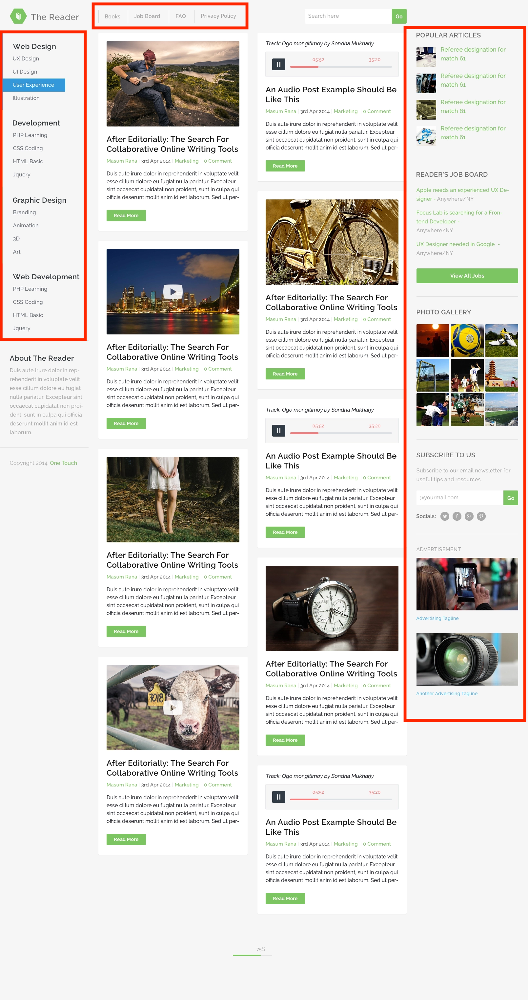
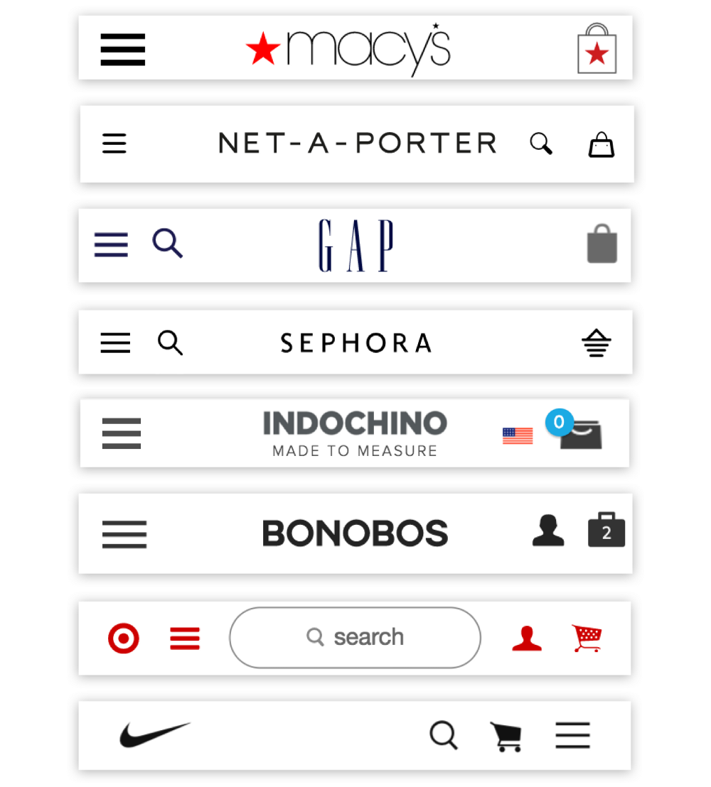

# Chapter1 網站架構(websize architecture)

## 導覽列
## 1.導覽列扮演的角色  
### 達成某種目的的手段
導覽列是一種提供給使用者的操作體系，可讓使用者了解頁面的位置關係與移動方式，而
且其操作方式具有一貫性。設計精良的導覽列系統可提醒使用者目前的所在頁面，也能讓做用者明白接下來還能去哪個頁面，因此能讓使用者感受到網站與應用程式的價值。

只要能了解目前的所在頁面，應該就能了解該頁面與其他頁面之間的關係。如果以其他的
方式進入頁面，很可能該頁面與其他頁面之間的關聯性就會消失，使用者就非常難以理解該頁面的內容。最為顯著的例子就是從外部搜尋引擎移動到網站深處的頁面的時候。導覽列不僅說明了目前的所在頁面，也能說明內容的意義，所以導覽列與頁面標題等元素是同等重要的，而且也有助於解釋頁面內容的意義。

導覽列的設計者很容易以為使用者會朝著需要的資訊直線前進，但事實並非如此。透過搜尋引擎直接瀏覽網站深處的頁面之後，使用者可能會透過分類頁面前往其他頁面，也可能利用關鍵字搜尋或導覽列前往其他頁面，總之行動的模式非常多元，所以導覽列也必須設計得更有彈性，才能應付使用者不可預期的行為模式。

只要能設計出好用的導覽列，所有的操作都將變得流暢，如果能讓使用者忘記導覽列的存
在，這種導覽列的設計才是最為理想的，因為使用者都是抱著要達成某個目的才造訪網站或使用應用程式，而導覽列只是在一旁協助使用者達成目的的手段而己。

---

## 2.不同類型的導覽列區塊 

### 負責引路的導質列

導覽列不只是讓使用者在頁面之間移動的機制，還能負責引導使用者。有些時候，使用者
會需要知道目前到底位於網站何處，此時配置導覽列的區塊不能只是提供切換頁面的操作，還必須依照各自扮演的角色，必須固定在網頁的某個位置，使用者才能了解且前到底位於網站何處。

配置導覽列的區塊是由「頁首」、「全域導覽列」、「麵包屑導覽」、「區域導覽列」、
「關聯性導覽列」、「頁尾」所組成，「主要內容」則是該頁面的主要資訊。

---

---

智慧型手機與平板電腦這類畫面大小有限的裝置所能使用的導覽列區塊非常有限，尤其智
慧型手機更是有限，所以不能隨便配置太多個導覽列區塊，也應該選擇垂直疊放的樣式，而不是左右排列，不然就是採用能左右滑動畫面的互動性操作，總之得花更多心思在導覽列的構造與編排的設計才行。

---

---

## 3.常駐於畫面的「頁首與頁尾」

### 貫穿整個網站的共通區塊

「頁首與頁尾」是基本都會配置在每個網頁的共通元泰，讓該網頁擁有網站或應用程式相
同的功能。頁首配置了 LOGO、搜尋功能等與網站品牌有關的功能，頁尾則配置了頁面的使用規範以及輔助的導引線。

不過最近的頁首與頁尾變得越來越重要。左右寬度較窄的智慧型手機很需要在這兩個區塊裡配置導引線。即使是使用智慧型手機以外的裝置，仍然不可忽視頁首或頁尾擔任導覽列一角的潛力，尤其是在配置「大型下拉式選單」(mega drop-down menu）或是「網站地圖」的時候，頁首與頁尾更是顯得重要。

---

### 階層化的整體俯瞰圖

所謂的大型下拉式選單就是一整個區塊下拉式選單。通常配置在頁首或是全域導覽裡，只要滑鼠移入該區塊或是點選，就會立刻顯示巨大的選單。為了能讓所有的選項分組顯
示，這種選單通常設計成不能捲動，以讓使用者能一次看到所有選項。

網站地圖式頁尾則屬於配置了簡易型網站地圖、分量十足的頁尾區塊。如果是位於畫面最
下方的頁尾，即便放大範圍也不會干擾主要內容，也不需要瀏覽到最後還要捲動到最上方才能切換到其他頁面裡，只要滑鼠移入該區塊或是點選，就會立刻顯示巨大的選單。為了能讓所有的選項分組顯示，這種選單通常設計成不能捲動，以讓使用者能一次看到所有選項。

大型下拉式選單與網站地圖式頁尾都擁有相同的設計目的，也就是「讓使用者了解網站全
貌，只要隨手一點就能移往目標網頁」。這比另外設計一個網站地圖頁面（網站地圖頁面通常是為了將使用者引導至網站深處而設計）還來得方便之餘，使用者也能保有連貫的思路來切換網頁。

## 4.代表位址與路徑的「麵包屑導覽」

### 具有輔助效果的文字資訊

「麵包屑導覽」代表的是網頁位於網站裡的位址與路徑，也稱為「麵包屑列表」或是「麵
包屑導覽列」。所謂的位址，是指該網頁與網站起點的「首頁」之開的相對位置，而路徑則是從首頁到達該網頁的脈絡。

---

麵包屑導覽通常扮演輔助性的角色，一般是作為輔助形式與全域導覽列或區域導覽列一起搭配使用。其與區域導覽列有著密切的關係，因為麵包屑導覽與區域導覽列的階層對構造會有部分的重疊。反之，兩者未重疊的部分可能就會妨礙使用者掌握目前的所在位置。
也因為如此，要幫助使用者掌握目前所在位置(或路徑）之前，必須先決定要以麵包屑導覽還是區域導覽列的何者為主要資訊。

---

雖然麵包屑導覽常扮演輔助性的角色，但是對於畫面太小，不方便設置全域導覽列或區域導覽列的裝置而言，卻成了非常重要的導覽列，尤其智慧型手機這種畫面非常窄的裝置，
麵包屑導覽更是能發揮莫大的效果。

---

## 5.不同類型的「麵包屑導覽」 

### 無法將路徑精簡為單一路徑時的課題

麵包屑導覽代表的是「位址」或是「路徑」，但是到達該頁面的路徑若不只一條時，該怎麼呈現麵包屑導覽呢？規模越大的網站越有可能遇到這類的問題。尤其是父頁面越多的時候，這類的煩惱會越來顯著，例如「Pod touch」這項商品的父頁面可以是「AV機器」、「行動裝置」、「蘋果產品」，而且這些父頁面在不同情況之下都有些微的差異。簡而言之，就構造而言，一個頁面是可以同時擁有多個父頁面的，所以麵包屑導覽的呈現方式也可以分成下列三種。

#### 優先型

這是優先顯示固定的麵包屑導覽的類型，也就是即使任何路徑都可以到達某張頁面，但是
該頁面絕不顯示不同的麵包屑導覽，等於是讓頁面只擁有一個位址，但反過來說，便無法確定到達該頁面的路徑。

#### 複數型

顯示多條麵包屑導覽的類型。這種類型的麵包屑導覽雖然可以明白指出多條路徑，但是卻無法分辨出是從哪條路徑移動到該網頁。另外，即使是同一個頁面，但是擁有多個位址
這種詭異感以及過於冗長的麵包屑導覽都讓人覺得不適當的設計。

#### 變動型

隨著路徑切換麵包屑導覽內容的類型。可参考前一頁的資訊或是依照URL裡的字串切換麵包層導覽的手法。由於屬於動態切換，所以運作的難度也較高。

## 6.「全域導覽列」與「區域導覽列」

### 代表構造與位置關係的主導線

全域導覽列與區域導覽列可代表網站或應用程式的基本構造，也是各種導覽列之中擔任主
角的導覽列。利用全域導覽列與區域導覽列標記目前所在位置，可呈現目前的頁面與整體網站之間的相對關係，也是實現具有一致性的操作體系前往目標位置的移動手段。

---

PC 版網站以及其他種類的網站都習慣將全域導覽列與區域導覽列配置在每個頁面內。如
果要問為什麼全域與區域這種兩段式的導覽列會成為常見的導覽列，是因為「主要導覽列
多便利性越高，複雜度也會相對增加」以及「畫面屬於平面的空間，垂直方向配置一個導覽列，水平方向也配置一個導覽列，比較容易規劃畫面裡的空間」。

---

因此，即使在理論與實物上都可在畫面裡配置超過三個導覽列（例如水平導覽列、垂直導覽列、水平導覽列這種互相交錯的組合，或是水平導覽列、水平導覽列、水平導覽列這種層疊式的組合），但是一般而言，還是不會在一個畫面裡配置三個導列。

---

智慧型手機與其他畫面尺寸受限的裝置有時不大容易同時配置全域導覽列與區域導覽列，
尤其智慧型手機實質上只能在垂直或水平方向設置一個導覽列，因此通常只能配置全域導覽列，而無法配置區域導覽列。

## 7.使用者可從他處回流的「關聯性導覽列」

### 跳至其他相關的頁面

關聯性導覽列與網站的構造以及目前所在位置没有關係，可在接收該頁面內容之後，直接
連往其他相關的網頁。具體來說，就是「有關這項商品分類的 FAQ 頁面請點選此處」的存取相關資訊功能，以及「瀏覽此網頁的使用者也常瀏覽這個頁面」的推薦功能。
關聯性導覽列不包含任何代表位置關係的元素，只是一種接受主要內容區塊的內容並提供
前往其他頁面的功能，所以通常會配置在畫面右側、結尾處或者是區域導覽列下方等不大惹人注意的位置。除此之外，關聯性導列也可能配置橫幅丶廣告以及篩選功能等龐雜的資訊與功能，所以原本就不太希望引起使用者注意。

---

話說回來，關聯性導覽列的使用方法與設計方法仍然有可能影響網站的方向，所以一樣是
不可忽視的存在。例如 Amazon 的關聯性導覽列就提供了讓使用者覺得有價值的連結與資訊。

## 8.垂直型與水平型的「區域導覽列」 
### 特徵不同的兩種類型

區域導覽列可分成「垂直型」與「水平型」兩種，而這兩種類型各有其優缺點。
垂直型區域導覽列通常會在雙欄式或三欄式版面裡出現，配置的位置可能會在主要內容區
塊的左右兩側。

區域導覽列的特徵之一就是可讓使用者透過階層構造了解目前的所在位置。就這一項優點而言，垂直型的區域導覽列比較優異，而且當要顯示的選項較多時，垂直方向的編排也比較能夠容納較多的選項，這是垂直型區域導覽列的優點之一。而垂直型區域導覽列的缺點在於會完全佔據畫面左側或右側的空間，某種程度等於縮減了主要內容區塊的大小。

相反的，水平型區域導覽列就只顯示同一階層的選項，屬於一眼就能看到所有選項的精巧設計，也不會壓迫主要內容區塊的空間。不過水平型區域導覽列的缺點在於可使用的畫面
會隨著裝置的畫面大小而改變，所以能放置的選項也非常有限。此外，這種水平型區域導覽列也只能顯示同一階層的選項，很難讓使者清楚網站的構造。

因此，到底要選用哪種區域導覽列得由網站的階層深度、分類的數量以及主要內容區塊
到底要配置多少內容決定。如果網站的階層深度很深，資訊量又非當龐大時，或許可同時使用水平型與垂直型的區域導覽列。

---

## 9.透過「區域導覽列」顯示的階層

### 同階層顯示、下層顯示區域

導覽列的構造為階層構造時，大致上可分成三種方式顯示這種構造。

- 顯示目前所在位置的「只下層構造類型」
- 顯示目前所在位置的「下層構造和下下層構造」

「只顯示下層構造類型」除了透過階層說明連結之間的相對位置，也可透過區域導覽列「移
動至下層」。由於這種類型的導覽列不能進行「同階層內的移動」，所以移動至上階層之後，必須重新回到下階層來。

「下層構造和下下層構造」 除了可以顯示階層者相對位置，還可以透過區域導覽列於「同階層之間」移動。由於這種類型的導覽列可在同層裡移動，所以擁有較高的回流性。但相反的，就得在「往下層移動」這點上多花心思。區域導覽列除了可以顯示「同階層」的連結，還可以加上「下層」連結的設計 ，或是利用主要內容區塊的連結「往下層移動」（水平型區域導覽列在構造上必須屬於同階層類型）是便利性高，但創意性底的構造

---

## 10.「樹狀型區域導覽列」的位置  

### 左邊右邊，哪邊合適？
區域導覽列配置在網站左側可說是主流，不過曾有一段時間習慣配置在右側，原因是把「主要內容區塊」配置在左側，比較容易讓使用者一進到網站就注意到，或是主要內容區塊的右側被截斷不太好看，以及能夠提高 SEO(Search Engine Optimization，搜尋引擎最佳
化）的效率，也有人認為這種設計比較與眾不同，所以才將區域導覽列配置在畫面右側。

隨著搜尋引擎的進化以及標準的瀏覽器一定可以瀏覽 CSS 設計的版面，配置在右側的區
域導覽列已不具有 SEO 上的優勢了，盡管其他優點還在，但是配置在右側的區域導覽列已不像之前如此常見。之所以如此演變，其中一個理由是配置在右側的區域導覽列在展開階層構造時，看起來不太自然，尤其是樹狀型的區域導覽列更是顯得不太自然。

### 順著文字的流向配置

不論是日文、英文還是中文，都是由左至右閱讀的文字，因此代表階層的「縮排」。應該置於文字的左側，也因此區域導覽列的階層構造應該是由上而下、由左至右的流向才對。一旦區域導覽列配置在右側，當視線移至畫面最右側，就必須大幅移回左側才能繼續瀏覽主要內容區，而這種視線的流動是不自然的，無法讓使用者輕鬆地閱讀內容。

---

**區域導覽列扮演的是說明網站內部階層構造以及目前所在位置的角色**，所以讓使用者瀏覽內容之前，先見到區域導覽列才算是自然的。換句話說，樹狀型的區域導覽列應該配置在主
要內容區塊的左側才能營造自然的印象，也才能更有效地扮演應有的角色。

## 12.「主要內容區塊」的位置

### 將優先順序較高的內容配置在左側

區域導覽列或各種篩選功能必須與主要內容區塊分佔兩側時，主要內容區塊應該配置在左
側還是右側比較好昵？

若從結論說起，基本上優先順序較高的內容應該配置在畫面的左側才對，理由不只是因為
視覺由左側開始流動，還因為畫面寬度較窄時，右側的內容可能會被畫面的右側邊界截
斷，所以主要內容區塊、區域導覽列或是關聯性導覽列到底要配置在畫面的左側還是右側
端看該頁面以何者為重。

新聞報導類的網站會以主要内容區塊為重心，其餘的內容為配角，所以主要內容區塊配
置在左側比較適當。

---

反之，如果是需要掌握目前所在位置的網站，區域導覽列就該配置在畫面左側，主要內
容區塊配置在右側才適當，例如區域導覽列的構造為樹狀型的時候，就必須如此設計版面，
這不是說主要內容區塊不重要，而是重視掌握目前所在位置這件事，以及希望能透過區域導覽列讓使用者回流。

---

此外，如果需要配置各種條件的篩選功能而這些功能又會影響主要內容區塊的內容編排
時，通常將這些功能配置在畫面左側（或是內容區塊上方）會比較適當。如此一來，才能設計出能清楚陳列所有搜尋結果的版面。

## 13. 讓導覽列的位置與內容固定  

### 固定位置

想必大家都曾經有過瀏覽網頁瀏覽到迷路憤而關閉瀏覽器，不再繼續瀏覽的經驗吧。使
用者會迷路的理由很多，其中之一的理由是因為導覽列的位置與內容在毫無理由下改變。

全域導覽列、區域導覽列或是麵包屑導覽這些含有位置資訊的導覽列除非有明確的理由之
外，在網站裡的位置應該都要固定不變才行，這是為了保持主要内容區塊與導覽列區塊的差異性，讓使用者在瀏覽的過程中熟悉導覽列的位置。

當導覽列的位置或內容改變，單個網頁可能看不出差異，不過一旦使用者切換頁面，
就會因為導覽列的位置改變而覺得不對勁了，而徒增瀏覽網頁的困難度。

### 固定起點

除了位置之外，導覽列的內容或是資訊的起點（起始位置）最好也能固定 不變，因為使用者在切換頁面時必須透過產生變化的頁面元素來了解頁面的相關位置以及移動地點，而且固定導覽列的內容也能讓使用者在不知不覺之下熟悉資訊的起點。

幾乎所有網站的**全域導覽列與麵包屑導覽的起點都是固定的**，不過倒是常常看到因為區域導覽列的起點在每一個頁面的位置都不同，導致使用者無法了解目前所在位置的例子。如果區域導覽列的位置改變，讓網站的編排產生微妙的變化，反而能讓版面的編排變得中性一點，介面也顯得比較自然

特別在下列的情況裡，區域導覽列的位置與內容不固定反而是較佳的選擇:

- 「商品資訊」等內容資訊比導覽列的位置資訊還重要的情況。
- 「搜尋結果」等區域導覽列被當成篩選功能之，而不被當成導覽列的情況。
- 「會員註冊」、「聯絡我們」頁面等功能大幅切換的情況。

## 14. 一致性與靈活性

### 規則性與自由度

一致性與靈活性之間存在著互斥的關係，一方變強，另一方就被迫變弱。所謂的「一致性」可以當成規則性理解，靈活性則與自由度擁有相同的語意。

在設計上擁有 100%一致性的網站或應用程式都常存在著許多規則，例如元素與元件都是固定的，而新的元素無法在網站的構造以及元素裡佔有一席之地，相對的，這種設計有助於嚴格控管網站或應用程式，例如：Wikipedia 就是類似的範例。

而擁有 100% 靈活性的網站可被比喻成「無規則地帶」，除了能隨意地決定網站的構造，也能在頁面裡顯示任何元素，沒有規則的同時意謂著擁有最高的自由度，但是也
意謂著頁面之間沒有任何的整合性。草創時期的網站就是類似的範例。

---

> 靈活度高的apple網站

---

如今，大多數的網站或應用程式都介於兩者之間，也就是同時擁有一定程度的一致性與靈
活性，只要不追求 100% 的一致性，就能擁抱更多的靈活性。而犧牲某種程度的靈活性，就能得到多一點的一致性（例如能讓 LOGO、頁尾、頁首的設計變得一致），讓網站擁有更高的整合性，而原本各自獨立的頁面也能互相組成一個完整的網站。

> 一致性高的網站

---

要追求多高的一致性與靈活性，當然是設計網站時的重點之一，也只有在找出網站與應用
程式的功能與意義之後才能決定方向。可能的話，建議大家在網站設計初期就先決定兩者之間的比例。越是重要的規則得越先建立，因為建立規則之後再進行設計，會比從雜亂無章的設計找出規則還要容易許多。

在建立一致性的規則時，應該將重點放在建立不容易衍生例外的規則上，而不是放在建立
一個不容許任何例外發生的規則上，所以應該讓網站的外觀擁有能承受突發狀況的整合性，不過有些時候會被迫跳脫規則或是必須跳脫規則才能提升整體效果。如果進行製作不符一致性規則的設計，也應該止於枝微末節的部分，儘可能不要動到一定得符合一致性規則的區塊。總之要注意的是，要能不產生違和感地維持網站設計的一致性，藉此提升網站的效果、意義與實用性。

## 15. 一致性的效果

### 昜懂性與實用性

要想讓使用者覺得是相同的網站或應用程式，就必須讓操作方式或設計擁有一致性，例
如：以相同的規則設計頁首、頁尾、顏色、按鈕、圖示等視覺元素以及導覽列的操作方式。

擁有一致性的介面將能兼顧介面的易懂性與實用性。如果要舉例的話，大部分的使用者都覺得ios (iPhone）的智慧型手機應用程式比Android 的智慧型手機應用程式容易操作，其原因可能是因為整個系統的操作方式較簡單，或是視覺設計的元素較統一的關係，但是另項重要的原因應該是有沒有獨立的「回上頁」按鈕這一點，因為獨立的「回上一頁」按鈕的設計可連帶地為頁面創造一致性。

iPhone 不管是在硬體還是 OS，都沒有提供「回上一頁」按鈕，所以必須由應用程式提供「回上一頁」的功能，使得大部分的應用程式都需要這項功能，所以通常會在頁首標題的左側配置一個「上一頁頁面標籤」的按鈕。

另一方面，Android 智慧型手機的「回上一頁」按鈕是由硬體或 OS 提供，所以不需要像10S一樣在畫面裡配置「回上一頁」按鈕的功能，也不一定非得將按鈕配置在頁首裡。

不過 iOS的「回上一頁」按鈕雖然會佔據頁首的空間，但也能明確地標示出 「目前所在位置」或「上一頁頁面標籤」的內容，而且大部分的頁面都需要「回上一頁」按鈕，所以就結果來看，配置「回上一頁」按鈕反而讓所有的頁面都能顯示目前所在位置與上一頁頁面標籤，也等於賦子所有的頁面一致性，而這樣的一致性也讓 i0S 的操作變得更簡單好用。

反觀 Android 的設計就比較不受拘束，所以能否設計出擁有一致性的介面，端看開發人員與設計師的功力，而功力的高低也決定了應用程式的自由度以及操作上的實用性了。

## 「迷路」的原因何在

### 2大要因

#### - 不知身在何處
#### - 不知如何操作

在網站或應用程式裡「迷路」到底是什麼狀態呢？會在網站與應用程式裡「迷路」的理由
應該可歸結出兩大要因，一者是「不知身在何處」，一者是「不知道該如何操作」，又或者同時具備這兩種要因。更正確來說，應該就是「無法掌握該頁面與整體網站之間的相對位置」以及「不了解操作的規則性與一致性」。

例如要駕車前往某個目的地，不知道該將車子往哪個方向開就是「不知道身在何處」的意
思，而不知道車子該怎麼開，則是「不了解操作方法」的意思。如果能夠了解上述兩者，就能順理成章地到達目的地了

### 相對位置與一致性的呈現

為了讓使用者了解目前身在何處，就必須提醒使用者目前的位置與整體之間的相對位置，
因此開發人員可在全域導覽列、區域導覽列、麵包屑導覽這些導覽列標記目前所在位置，或是利用畫面元素的變化量以及頁面切換的互動性等前後關係的表現，以各種介面、設計效果來提醒使用者。

為了讓使用者了解操作方法，則必須設計出擁有規則性與一致性的操作方式，例如版型、頁面元素與元件都應該擁有一致的使用方法與效果，而這種具有一致性的設計可讓使用者預測接下來的操作將會產生什麼結果。

由此可知，相對位置的標示與操作方法的一致性都是讓網站或應用程式變得「簡單易懂」的重要因素。

