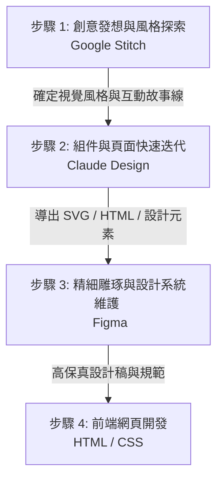

# 建立提案用的原型網頁 🚀

在進行網站提案時，如何在極短的時間內將抽象的創意轉化為客戶「看得見、點得了」的互動原型，是決定提案成功與否的關鍵。傳統流程中，專案管理員與設計師需要花費數天甚至數週在 Figma 中拉線框圖、調整細節；現在，透過 AI 賦能的設計工具，我們可以在數小時內完成多套概念設計、串接互動流程並導出代碼。

本單元將深入介紹如何整合 **Google Stitch**、**Claude Design** 與 **Figma** 三大工具，打造出高效、美觀且具備說服力的提案原型工作流。

---

## 🛠️ 三大工具核心定位

### 1. [Google Stitch](https://stitch.withgoogle.com/) (AI 原生軟體設計畫布)
*   **定位**：早期概念探索與「氛圍設計（Vibe Design）」的 AI 原生畫布。
*   **核心特色**：
    *   **氛圍設計**：不需要從空白畫布開始，只需輸入業務目標、目標用戶感受（如「專業、溫暖、極簡」）或上傳參考截圖，AI 就會自動生成高保真 UI 設計。
    *   **無限畫布 (Infinite Canvas)**：在一個無邊界的空間中自由整理靈感、文字、圖像與代碼。
    *   **自動畫面串接 (Stitching)**：能自動根據用戶的操作行為生成邏輯上的下一頁，快速拼湊出一個完整的點擊互動流程（User Journey）。
    *   **設計轉代碼**：支持生成前端程式碼（HTML/CSS/JSX），並可導出至 AI Studio。

### 2. [Claude Design](https://claude.ai/design) (對話式視覺設計與微調)
*   **定位**：透過對話快速生成、微調網頁佈局與視覺組件的協作助手。
*   **核心特色**：
    *   **對話式建構**：直接用自然語言描述需求（例如：「幫我做一個帶有深色漸層背景的健身 App 登入頁面」），即可快速獲得初版設計。
    *   **直觀的微調控制項**：生成後除了能用對話修改，還能使用內建的「調整滑桿」來手動微調間距、配色、字體大小等，兼顧 AI 效率與精準操控。
    *   **加載設計系統 (Design Systems)**：可以讀取既有的程式碼或設計文件，確保生成的組件符合品牌規範。
    *   **代碼與多格式導出**：可導出為 HTML、PDF 或 PPTX，並能與 `Claude Code` 無縫對接進行前端開發。

### 3. [Figma](https://www.figma.com/) (專業級協作設計與定稿)
*   **定位**：高保真細節雕琢、組件庫管理與團隊協作的最終定稿平台。
*   **核心特色**：
    *   **像素級控制**：對圖層、間距、向量圖形進行最精準的調整。
    *   **設計系統維護**：建立可複用的 Components、Variables，確保大型專案的一致性。
    *   **精細互動設定**：設定複雜的微交互（Micro-interactions）與動畫過渡。
    *   **開發人員手接 (Dev Mode)**：方便工程師檢視程式碼屬性、導出切圖。

---

## 📊 工具特性比較表

| 評估維度 | Google Stitch 🎨 | Claude Design 💬 | Figma 📐 |
| :--- | :--- | :--- | :--- |
| **主要輸入方式** | 自然語言說明 + 氛圍描述 + 參考圖 | 自然語言對話 + 視覺化微調控制項 | 滑鼠拖曳 + 向量編輯 + 參數面板 |
| **生成速度** | 🚀 快速（秒級生成多套佈局） | 🚀 快速（秒級生成特定組件/頁面） | ⏱️ 較慢（需人工手動繪製與排版） |
| **細節掌控度** | 🟡 中等（依賴 AI 生成與引導） | 🟢 中至高（支持對話修改與控制項微調） | 🟢 極高（像素級精準度，可任意修改） |
| **互動原型** | 🟢 快速串接畫面流，AI 自動預測 | 🟡 支援基礎的組件層級互動 | 🟢 強大且精細的彈出、滑動與微交互 |
| **產出物** | 高保真 UI 畫面、前端代碼、互動流程 | 網頁代碼、組件、PPTX、PDF 提案簡報 | 向量設計稿、互動原型、CSS 屬性、組件庫 |
| **最適用階段** | **創意發想、風格探索、故事線串接** | **快速介面迭代、組件生成、簡報排版** | **細節定稿、設計系統建立、工程對接** |

---

## 🔄 AI 輔助原型提案工作流 (AI-Powered Prototyping Workflow)

為了兼顧「速度」與「品質」，推薦採用以下混合工作流來建立提案原型：

### 1. 探索階段：使用 Google Stitch 定義視覺氛圍
*   **操作**：在 Stitch 的無限畫布上輸入提案專案的背景。例如：「*建立一個綠色科技的電商網站首頁，強調簡約、信任感，並展示三個主要產品。*」
*   **目標**：快速產出 3-4 種不同風格的視覺提案，並利用 Stitch 的畫面串接功能，快速拼湊出基本的點擊路徑，用於最初期的概念確認。

### 2. 迭代階段：使用 Claude Design 生成具體組件與內容
*   **操作**：針對 Stitch 確定的方向，使用 Claude Design 來細化具體的網頁區塊（Hero Section、產品卡片、聯絡表單）。
*   **目標**：透過對話填入真實的提案文案（避免使用 Lorem Ipsum 假字），並使用內建的調整控制項，微調版面比例與色彩，快速導出高品質的 HTML/CSS 組件。

### 3. 定稿階段：使用 Figma 進行像素級整合
*   **操作**：將 Claude Design 或 Stitch 產出的設計元素匯入 Figma。
*   **目標**：
    *   建立標準的設計系統（色彩規範、字體層級、按鈕組件）。
    *   微調所有元素的對齊與間距，確保符合網頁佈局模式。
    *   在 Figma 中設定高保真的 Prototype 連結，準備向客戶進行最終提案演示。

---

## 💡 提案原型的 UI/UX 注意事項

在利用 AI 工具快速生成原型時，請務必檢視以下原則，以確保原型不僅好看，而且好用：
1.  **立體構造清晰**：使用者點擊按鈕後，新畫面是從「前後（覆蓋/滑出）」出現，還是「垂直（向下滾動）」展開？確保在原型中透過動畫表達清楚。（參考：[垂直、水平、前後的立體構造](../垂直_水平_前後的立體構造/README.md)）
2.  **避免讓使用者迷路**：在原型中保留明顯的導覽列或麵包屑，讓點擊體驗更貼近真實網站。（參考：[導覽列](../導覽列/README.md)）
3.  **無縫式體驗優先**：針對表單提交、登入、購物車等場景，優先在 AI 生成時採用覆蓋式（Overlay）或嵌入式（Embedded）設計，避免不必要的頁面跳轉。（參考：[無縫式介面](../無縫式介面/README.md)）